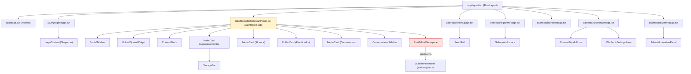
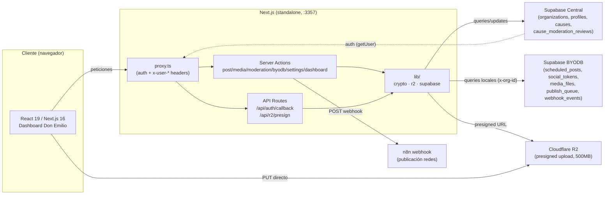
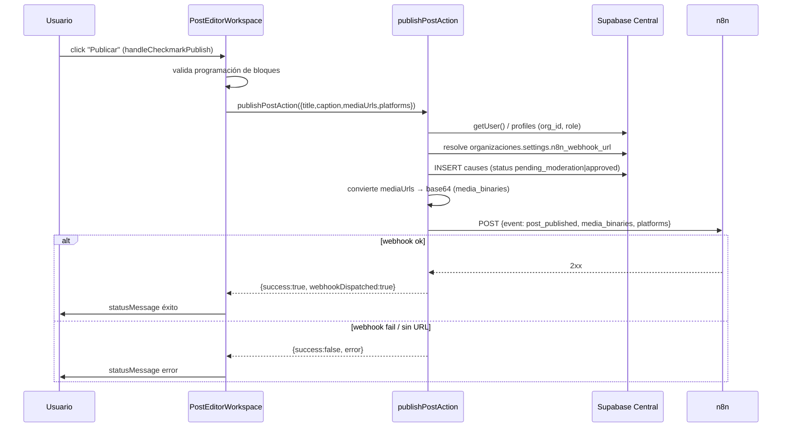
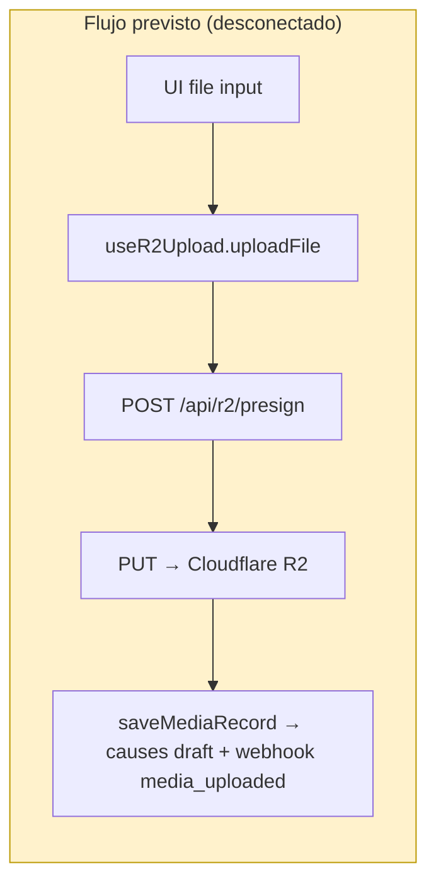
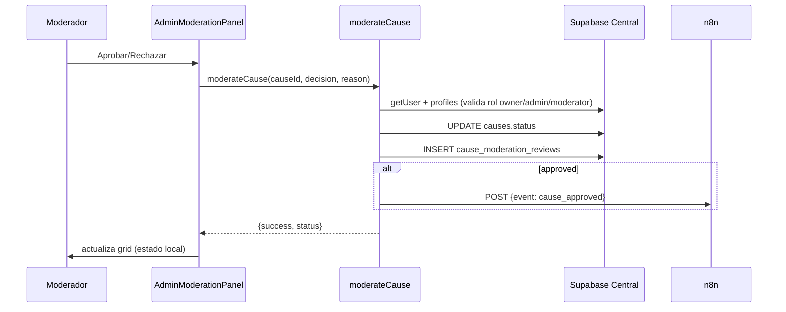
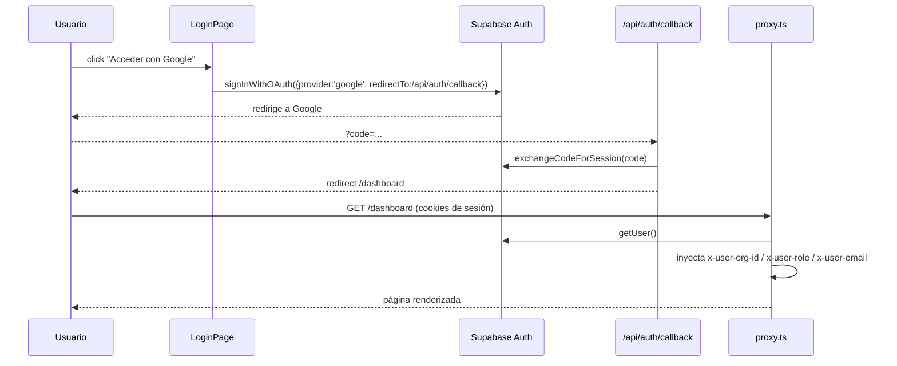

# 📐 ARQUITECTURA COMPLETA — NUH (Central de Mando Multi-Tenant)

> **"Fuente de verdad" del proyecto — v1.1 (Build 4 Venezuela)**
>
> ⚠️ **Nota crítica de discrepancia.** El encargo de esta auditoría describe un proyecto llamado
> **"Filo Studio / OpenMontage"** con una estructura `backlot/` (Python/FastAPI), `web/src/`,
> `tools/` y `tests/`. **Ese proyecto no existe en este repositorio.** Lo que sí existe — y es lo que se
> audita aquí, verificado archivo por archivo — es **"NUH"** (`hun-oficial-v1` en `package.json`),
> una plataforma **SaaS multi-tenant para publicación automatizada en redes sociales**, construida
> íntegramente en **TypeScript** sobre **Next.js 16 (App Router)**, **Supabase** (central + BYODB),
> **Cloudflare R2** y **n8n** como orquestador de publicación.
>
> No hay código Python, ni FastAPI, ni `backlot/`, ni `tools/`, ni suites de tests. Todas las
> referencias a esos elementos en el encargo se han reinterpretado a su equivalente real.

---

## 0. Resumen ejecutivo

**NUH** es una aplicación web **multi-tenant** que permite a organizaciones (típicamente ONGs /
causas sociales en Venezuela, bajo el paraguas "Build 4 Venezuela"):

1. Autenticarse con **Google OAuth** (Supabase Auth + whitelist de organizaciones).
2. Gestionar un **dashboard** visual (diseñado por "Don Emilio") con proyectos/borradores de publicaciones.
3. Subir **multimedia** (imagen/vídeo, máx. 500 MB) directamente a **Cloudflare R2** vía URLs pre-firmadas.
4. Componer **publicaciones multi-variación** y programarlas.
5. **Moderar** causas (aprobar/rechazar) por roles.
6. **Publicar** disparando un **webhook a n8n**, que se encarga de la difusión multi-canal.
7. Conectar una **base de datos propia (BYODB)** por organización (Supabase local del cliente), con credenciales cifradas en reposo.

### Datos clave de un vistazo

| Dimensión | Valor |
|---|---|
| Nombre del paquete | `hun-oficial-v1` (v0.1.0, private) |
| Framework | Next.js **16.2.10** (App Router, `output: 'standalone'`) |
| Runtime UI | React **19.2.4** + framer-motion 12 + Tailwind CSS 4 |
| Lenguaje | TypeScript **^5** (strict, `@/*` path alias a raíz) |
| Backend | Server Actions (`'use server'`) + API Routes + `proxy.ts` (Next 16) |
| BBDD Central | Supabase (Postgres) — `rbptlzqmfdxmucqkpvie.supabase.co` |
| BBDD por tenant | Supabase BYODB (instancia del cliente) |
| Storage | Cloudflare R2 (bucket `hun-v01-oficial`), S3-compatible |
| Orquestación | n8n (webhooks `media_uploaded`, `post_published`, `cause_approved`) |
| Puertos/despliegue | Docker multi-stage, puerto **3357**, `HOSTNAME=0.0.0.0` |
| Tests | **Ninguno** (no existe directorio `tests/` ni archivos `*.test.*`/`*.spec.*`) |

### Mapa mental (arquitectura lógica)

```
[ Navegador ]
     │  (1) /login → Google OAuth
     ▼
[ proxy.ts ] ── valida sesión (Supabase Auth) ── inyecta x-user-org-id / x-user-role / x-user-email
     │
     ├── /dashboard (client, dashboard visual)
     ├── /dashboard/{feed,gallery,profile,settings,admin} (server/client)
     ├── Server Actions  (post, media, moderation, byodb, settings, dashboard)
     ├── /api/r2/presign (presigned URL) ──► Cloudflare R2
     └── /api/auth/callback (OAuth)
               │
               ├──► Supabase Central  (organizations, profiles, causes, cause_moderation_reviews)
               ├──► Supabase BYODB    (scheduled_posts, social_tokens, media_files, publish_queue, webhook_events)
               └──► n8n webhook       (orquestador de publicación en redes)
```

---

## 1. Estructura del repositorio

Inventario completo (62 archivos, excluyendo `.git/`, `node_modules/` — **ausente** — y `.next/`).

```
.
├── .dockerignore / .gitignore
├── AGENTS.md                # Reglas Next.js 16 (léase node_modules/next/dist/docs antes de codear)
├── CLAUDE.md                # @AGENTS.md (redirección)
├── Dockerfile               # Multi-stage standalone (node:22-alpine, EXPOSE 3357)
├── docker-compose.yml       # Servicio hun-frontend, puerto 3357, env vars
├── Homework.md              # Hoja de ruta MVP v1.1 + regla de invariantes (Don Emilio)
├── README.md                # Plantilla create-next-app (sin actualizar)
├── eslint.config.mjs        # next/core-web-vitals + next/typescript
├── inventario_recursos_dependencias.csv  # Inventario de 84 recursos/dependencias/tablas
├── next.config.ts           # output: 'standalone'
├── package.json / package-lock.json
├── postcss.config.mjs       # @tailwindcss/postcss
├── proxy.ts                 # ⭐ Proxy de Next 16 (auth + inyección de headers)
├── tsconfig.json
│
├── UI/
│   └── BKND.md              # Especificación backend: programación y cola de variaciones
│
├── app/                     # ⭐ App Router
│   ├── (auth)/login/page.tsx              (153 l)  Login Google OAuth
│   ├── (dashboard)/dashboard/
│   │   ├── page.tsx                        (672 l)  ⭐ Dashboard principal (client)
│   │   ├── admin/page.tsx                  (102 l)  Panel moderación (server)
│   │   ├── admin/ModerationPanel.tsx       (226 l)  Grid moderación (client)
│   │   ├── feed/page.tsx                   (91 l)   Feed global (server, revalidate=60)
│   │   ├── gallery/page.tsx                (84 l)   Galería (server)
│   │   ├── profile/page.tsx                (113 l)  Perfil (server)
│   │   ├── settings/page.tsx               (200 l)  Ajustes (server)
│   │   └── settings/WebhookSettingsForm.tsx (103 l) Form n8n (client)
│   ├── actions/             # ⭐ Server Actions ('use server')
│   │   ├── byodb.ts         (195 l)  connectByodb / getByodbStatus
│   │   ├── dashboard.ts     (144 l)  getDashboardData (⚠ sin uso)
│   │   ├── media.ts         (99 l)   saveMediaRecord (⚠ sin uso)
│   │   ├── moderation.ts    (99 l)   moderateCause
│   │   ├── post.ts          (247 l)  publishPostAction
│   │   └── settings.ts      (200 l)  saveN8nWebhook / getN8nWebhook
│   ├── api/
│   │   ├── auth/callback/route.ts (67 l)  GET — exchangeCodeForSession
│   │   └── r2/presign/route.ts    (42 l)  POST — presigned URL
│   ├── favicon.ico
│   ├── globals.css          (169 l)  Design system "Don Emilio" (Tailwind 4 @theme)
│   ├── layout.tsx           (37 l)   Root layout (fuentes Inter/Anton/Barlow)
│   └── page.tsx             (5 l)    redirect('/dashboard')
│
├── components/
│   ├── ConnectByodbForm.tsx (224 l)  Formulario conexión BYODB
│   └── dashboard/
│       ├── ContentStack.tsx          (114 l)  Stack 3D "Contenidos"
│       ├── ConversationsSidebar.tsx  (286 l)  Sidebar de proyectos/borradores
│       ├── FeedGrid.tsx              (137 l)  Grid del feed global
│       ├── FolderCard.tsx            (56 l)   Tarjeta-carpeta (pestaña superior)
│       ├── GalleryWorkspace.tsx      (228 l)  Galería con filtros + modal
│       ├── PostEditorWorkspace.tsx   (1954 l) ⭐ Editor de publicaciones (el más grande)
│       ├── SocialSidebar.tsx         (273 l)  Sidebar de redes + utilidades
│       ├── StorageBar.tsx            (41 l)   Barra de almacenamiento
│       └── UploadQueueWidget.tsx     (152 l)  Widget "Subidas en fila"
│
├── hooks/
│   └── useR2Upload.ts       (63 l)   Hook de subida R2 (⚠ sin uso)
│
├── lib/                     # ⭐ Conectores/helpers de backend
│   ├── crypto.ts            (58 l)   encryptText / decryptText (AES-256-GCM)
│   ├── r2.ts                (83 l)   generatePresignedUploadUrl
│   └── supabase.ts          (35 l)   createBrowserClient / createLocalClient
│
├── public/                  # SVGs por defecto de create-next-app (file/globe/next/vercel/window.svg)
├── supabase/migrations/
│   ├── 001_schema_central.sql  (285 l)  Esquema Supabase Central
│   └── 002_schema_local_byodb.sql (265 l)  Esquema Supabase BYODB
└── docs/                    # Auditoría V2, Protocolo FE/BE, Bitácora IA
```

### Carpetas críticas vs. secundarias

| Clasificación | Carpeta/Archivo | Motivo |
|---|---|---|
| 🔴 Crítico | `proxy.ts` | Único guardián de autenticación/autorización de rutas |
| 🔴 Crítico | `app/actions/*` | Toda la lógica de negocio (server actions) |
| 🔴 Crítico | `app/api/*` | Endpoints HTTP (OAuth callback, presign R2) |
| 🔴 Crítico | `lib/*` | Criptografía, R2, clientes Supabase |
| 🔴 Crítico | `supabase/migrations/*` | Contratos de datos (tablas + RLS) |
| 🟡 Importante | `components/dashboard/*` | UI "Don Emilio" (zona congelada por invariante) |
| 🟡 Importante | `app/(dashboard)/dashboard/page.tsx` | Orquestador de estado del dashboard |
| 🟢 Secundario | `public/*.svg`, `README.md` | Defaults de create-next-app |
| 🟢 Secundario | `hooks/useR2Upload.ts` | No referenciado por nadie |
| 🟢 Secundario | `docs/*`, `inventario_*.csv`, `UI/BKND.md` | Documentación/contexto |

---

## 2. Arquitectura backend

No existe un "backend" separado (Python/FastAPI). El backend es **Next.js** ejecutando:
**proxy → API Routes → Server Actions → lib → (Supabase Central | Supabase BYODB | R2 | n8n)**.

### 2.1 `proxy.ts` — capa de red / guardián (Next 16)

- **Rol:** intercepta peticiones, valida sesión y **inyecta cabeceras de contexto** (`x-user-org-id`, `x-user-role`, `x-user-email`) que luego leen Server Actions y páginas.
- **`config.matcher`** (líneas 153-155): excluye `_next/static`, `_next/image`, `favicon.ico` y assets estáticos (`svg|png|jpg|jpeg|gif|webp|ico|css|js`).
- **Rutas interceptadas** (líneas 9-15):
  - `isDashboardRoute`: `pathname === '/'` **o** `startsWith('/dashboard')`.
  - `isApiRoute`: `startsWith('/api')` **y** `!startsWith('/api/auth')` (el callback OAuth queda fuera).
- **Flujo**:
  1. Crea `createServerClient` de `@supabase/ssr` con adaptador de cookies (`getAll`/`setAll`).
  2. `supabase.auth.getUser()` → valida contra el servidor.
  3. Si **no hay usuario**:
     - **En localhost/127.0.0.1**: inyecta cabeceras de prueba (`org-1`, rol `admin`, `dev@local.nuh.com`) y **permite el paso sin autenticarse** (⚠ bypass de desarrollo — ver §13).
     - En producción: `NextResponse.redirect(getSafeRedirectUrl('/login'))`.
  4. Si **hay usuario**: busca `SUPABASE_CENTRAL_SERVICE_ROLE_KEY` (acepta ambas convenciones). Con ella crea un `adminClient` (service role) y consulta `profiles` (`org_id, role`) por `user.id`, inyectando esos valores en las cabeceras.
  5. **Fallbacks defensivos** (anti-bloqueo del MVP): si falta la service key o falla el `fetch` de `profiles`, inyecta `org-1` / rol `owner`.
- **`getSafeRedirectUrl`** (líneas 51-77): construye URLs de redirección seguras (localhost → origin; producción → `NEXT_PUBLIC_APP_URL`, o `x-forwarded-host`/`host`; detecta hosts internos de Docker).

> **Discrepancia de documentación**: `docs/BITACORA_IA_EMILIO.md` exige usar `middleware.ts` (no `proxy.ts`) por un bug de compilación en Dokploy + Docker Standalone. El repo **solo contiene `proxy.ts`** — ver §13.

### 2.2 API Routes

#### `GET /api/auth/callback` (`app/api/auth/callback/route.ts`, 67 l)
- **Propósito:** callback de Supabase OAuth.
- **Params:** `code` (código OAuth), `next` (ruta destino, default `/dashboard`).
- **Lógica:** `getSafeOrigin(request)` → si hay `code`, `supabase.auth.exchangeCodeForSession(code)`; en éxito redirige a `${origin}${next}`, en fallo a `/login?error=auth_callback_failed`.
- **Auth:** ninguna (es el propio callback; excluido del proxy).

#### `POST /api/r2/presign` (`app/api/r2/presign/route.ts`, 42 l)
- **Propósito:** devolver URL pre-firmada para subida directa a R2.
- **Auth:** requiere cabecera `x-user-org-id` (inyectada por el proxy); si falta → `401 { error: 'No autorizado' }`.
- **Input (Zod `PresignSchema`):**
  | Campo | Tipo | Reglas |
  |---|---|---|
  | `fileName` | string | min 1, máx 260 |
  | `mimeType` | string | min 1 (validado contra whitelist en `lib/r2`) |
  | `fileSize` | number | positivo, máx 524288000 (500 MB) |
- **Output:** `{ uploadUrl, publicUrl, r2Path }` (de `generatePresignedUploadUrl`).
- **Errores:** `400` (JSON inválido / schema) o `400` con mensaje del generador (MIME no permitido, excede 500 MB).

### 2.3 Server Actions (`app/actions/*`, todas `'use server'`)

#### `byodb.ts` — conexión de base de datos propia
| Símbolo | Tipo | Descripción |
|---|---|---|
| `ConnectByodbSchema` | Zod | `supabase_url` (URL https `.supabase.co`), `supabase_anon_key` (JWT `eyJ…`, min 20) |
| `ConnectByodbInput` | type | `z.infer<typeof ConnectByodbSchema>` |
| `ActionResult` | interface | `{ success, message, error? }` |
| `connectByodb(formData)` | fn | Ver §flujos |
| `getByodbStatus()` | fn | Devuelve `{ connected, url }` (solo hostname, nunca la URL completa) |

`connectByodb` hace, en orden:
1. `safeParse` Zod → si falla, `ActionResult` de error.
2. Lee `x-user-org-id` / `x-user-role` de `headers()`. Requiere `orgId` y rol `owner`/`admin`.
3. `createLocalClient(url, key, orgId)` → ping a tabla `scheduled_posts` (`select id limit 1`). Acepta `PGRST116` (tabla vacía) como válido.
4. Vuelve a leer `orgId` de headers.
5. `encryptText(url)` y `encryptText(key)` → `UPDATE organizations SET byodb_url_enc, byodb_key_enc, updated_at WHERE id = orgId`.

#### `dashboard.ts` — ⚠ **sin uso en la app**
| Símbolo | Descripción |
|---|---|
| `DashboardPost` | `{ id, title, description?, media_url?, active? }` |
| `DashboardOrg` | `{ id, name, posts: DashboardPost[] }` |
| `DashboardDataResult` | `{ organizations, activeOrgId, storage{usedGB,totalGB}, reachCount, plannerCount, commentsCount }` |
| `MOCK_ORGANIZATIONS` | 3 orgs hardcodeadas con posts `[MOCK]` |
| `getDashboardData()` | Consulta `organizations`/`causes` reales; si no hay datos, usa mocks; métricas estimadas (`totalCauses * 50`, `*1250`, etc.) |

#### `media.ts` — ⚠ **sin uso en la app**
`saveMediaRecord(mediaUrl, fileName)`: exige usuario + `profiles.org_id`, inserta `causes` con `status: 'draft'` y título `Upload: ${fileName}`, luego dispara webhook n8n `media_uploaded` (fire-and-forget). Retorna `{ success, causeId }`.

#### `moderation.ts`
`moderateCause(causeId, decision: 'approved'|'rejected', reason?)`:
1. `getUser()` (requiere usuario).
2. `profiles` → valida rol en `['owner','admin','moderator']`.
3. `UPDATE causes SET status=decision, rejection_reason=(reason si rejected)`.
4. `INSERT cause_moderation_reviews` (decision + notes).
5. Si `approved`: lee `organizations.settings.n8n_webhook_url` y dispara webhook `cause_approved`.

#### `post.ts` — publicación
| Símbolo | Descripción |
|---|---|
| `PublishPostPayload` | `{ title?, caption, mediaUrls: string[], platforms: string[], orgId? }` |
| `isUuid()` | Regex UUID |
| `getAdminClient()` | Cliente service-role (o `null` si no hay key) |
| `publishPostAction(payload)` | Ver §flujos (publicación) |

#### `settings.ts` — webhook n8n
| Símbolo | Descripción |
|---|---|
| `isUuid()` | Regex UUID (duplicado de `post.ts` ⚠) |
| `getAdminClient()` | Duplicado de `post.ts` ⚠ |
| `saveN8nWebhook(webhookUrl)` | Rol owner/admin → resuelve org (UUID o fallback primera org) → `organizations.update({ settings: { ...current, n8n_webhook_url } })` |
| `getN8nWebhook()` | Devuelve `{ url }` de `settings.n8n_webhook_url` |

### 2.4 `lib/` — conectores

#### `lib/crypto.ts`
- `encryptText(text): string` → AES-256-GCM; clave de `BYODB_ENCRYPTION_KEY || ENCRYPTION_SECRET` (64 hex → 32 bytes binarios; si no, relleno UTF-8 a 32). Formato salida: `iv:authTag:ciphertext` (hex).
- `decryptText(text): string | null` → `null` ante error de auth/clave.
- `getEncryptionKeyBuffer()`: lanza error si no hay clave configurada.

#### `lib/r2.ts`
- `R2_ENDPOINT = https://{R2_ACCOUNT_ID}.r2.cloudflarestorage.com`.
- `getR2Client()`: `S3Client` región `auto`.
- `ALLOWED_MIME_TYPES`: `image/jpeg, image/png, image/webp, image/gif, video/mp4, video/quicktime, video/x-msvideo, video/webm`.
- `MAX_FILE_SIZE_BYTES = 500 MB`.
- `PresignedUrlResult`: `{ uploadUrl, publicUrl, r2Path }`.
- `generatePresignedUploadUrl(orgId, fileName, mimeType, fileSize)`:
  1. valida MIME (anti-exploit) y tamaño.
  2. `sanitizedName = fileName.replace(/[^a-zA-Z0-9._-]/g, '_')`.
  3. `r2Path = orgs/{orgId}/{timestamp}_{sanitizedName}` (aislamiento multi-tenant).
  4. `getSignedUrl(..., { expiresIn: 900 })` (15 min).
  5. `publicUrl = ${NEXT_PUBLIC_R2_PUBLIC_URL}/${r2Path}`.

#### `lib/supabase.ts`
- `createBrowserClient()` → `createBrowserClient` de `@supabase/ssr` (client components).
- `createLocalClient(url, key, orgId?)` → cliente Supabase con `persistSession: false` e inyección de cabecera global `x-org-id` (para RLS del BYODB).

---

## 3. Arquitectura frontend

### 3.1 `app/layout.tsx` (root)
- Fuentes `next/font/google`: **Inter** (`--font-inter`), **Anton** (`--font-anton`), **Barlow Semi Condensed** (`--font-barlow-semi-condensed`).
- `metadata`: título **"NUH — Central de Publicación"**.
- `<html lang="es">` con clases de fuente + `h-full`; `<body class="min-h-full">{children}</body>`.

### 3.2 `app/globals.css` — design system (169 l)
- Importa `Telegraf` desde `fonts.cdnfonts.com` + `@import "tailwindcss"`.
- Variables CSS: `--nuh-bg #F6F6F6`, `--nuh-card #D9D9D9`, `--nuh-card-hover`, `--nuh-text-primary #000`, `--nuh-text-secondary #666`, `--nuh-text-muted #999`, `--nuh-gradient-crear (linear 90deg #FF61A6→#FFB84D)`, sombras y radios.
- `@theme inline`: mapea `--color-background/foreground`, `--font-sans`, `--font-display` (Tailwind 4).
- Clases utilitarias: `.nuh-title`, `.bento-card-clean`, `.folder-shape` (pestaña con `clip-path`), `.btn-crear`, `.content-stack*`.

### 3.3 Páginas

| Ruta | Tipo | Render | Función principal |
|---|---|---|---|
| `/` (`app/page.tsx`) | Server | — | `redirect('/dashboard')` |
| `/login` | Client | LoginContent + Suspense | Google OAuth, manejo de `?error=access_denied` |
| `/dashboard` | Client | DashboardPage (672 l) | Orquesta todo el dashboard/editor |
| `/dashboard/feed` | Server (`revalidate=60`) | FeedGrid | `causes` `status='approved'` (join `organizations` name) |
| `/dashboard/gallery` | Server | GalleryWorkspace | `causes` de la org con `media_url` |
| `/dashboard/profile` | Server | — | Muestra datos de headers (`x-user-*`) |
| `/dashboard/settings` | Server | ConnectByodbForm + WebhookSettingsForm | `getByodbStatus()` + forms |
| `/dashboard/admin` | Server | AdminModerationPanel | Rol-gate por header + `causes` pendientes |

> **Nota de render:** `feed`, `gallery`, `profile`, `settings`, `admin` son **Server Components** que leen datos de Supabase/headers directamente (sin Server Actions intermedias, excepto `settings` que usa `getByodbStatus`).

### 3.4 Página principal — `app/(dashboard)/dashboard/page.tsx` (672 l)

**Estados locales:**
| Estado | Tipo | Uso |
|---|---|---|
| `selectedFiles` | `SelectedMedia[]` | Multimedia seleccionada (file + objectURL + isVideo) |
| `isEditorActive` | boolean | Alterna vista Dashboard ↔ Editor |
| `selectedOrg` | string (`'org-1'`) | Org seleccionada (hardcoded `orgNames`) |
| `activeModal` | `'org'|'profile'|'storage'|'reach'|'planner'|'comments'|null` | Modal/dropdown activo |
| `projectsList` | `ProjectDraft[]` | Lista de borradores (se inicializa con `INITIAL_PROJECTS`) |
| `activeProjectId` | `string\|null` | Proyecto activo |

**Refs:** `fileInputRef` (input oculto de archivos).

**Datos hardcodeados:**
- `INITIAL_PROJECTS`: 4 proyectos de ejemplo (con `variationBlocks`, captions, thumbnails Unsplash).
- `orgNames`: 3 orgs `org-1/2/3` ("Organización número N").
- Métricas de carpetas: almacenamiento `3500/3688 GB`, alcance `252K`, planificador `8 hoy`, comentarios `100`.

**Handlers principales:**
| Handler | Qué hace |
|---|---|
| `handleFileSelect(e)` | Añade archivos a `selectedFiles` (objectURL) |
| `handleNewProjectClick` / `handleCrearClick` | Limpia selección, resetea proyecto, activa editor |
| `handleSelectProject(item)` | `setActiveProjectId` + activa editor |
| `handleSaveProject(updated)` | Actualiza `projectsList` (con dedupe por deep-equality) |
| `handleDeleteProject(id)` | Elimina proyecto y reasigna activo |
| `handleContentStartedForProject(titleHint)` | Crea nuevo borrador si no hay activo |
| `handleTitleChange(newTitle)` | Renombra proyecto activo o crea uno |
| `handleRemoveFile(i)` / `handleCancelSelection` | Gestión de selección multimedia |
| `handleConfirm` | `setIsEditorActive(true)` |
| `handleBackToDashboard` | `setIsEditorActive(false)` |

**Componentes que renderiza (vista dashboard):**
- Cabecera fija "Build For Venezuela" + "PRO".
- Título "NUH" animado (se encoge al entrar al editor).
- `SocialSidebar` (redes + utilidades).
- Botones "Organización" (dropdown) y "Crear" (gradiente).
- Previsualización de `selectedFiles` (con "Añadir / Cancelar / Confirmar").
- `UploadQueueWidget` (esquina sup. derecha).
- Fila inferior: `ContentStack` + 4 `FolderCard` (Almacenamiento/`StorageBar`, Alcance, Planificador, Comentarios).

**Vista editor (cuando `isEditorActive`):**
- `ConversationsSidebar` (panel izquierdo de borradores).
- `PostEditorWorkspace` (panel central, 56.8vw).

---

## 4. Modelos de datos

### 4.1 Tipos/interfaces TypeScript

#### `PostEditorWorkspace.tsx` (contratos centrales del editor)
```ts
interface SelectedMedia { file?: File; url: string; isVideo?: boolean; }

export interface ContentVariationBlock {
  id: string; number: number; caption: string;
  selectedPlatforms: string[]; thumbnails: string[];
  fileNames?: string[]; activeMediaIndex: number;
  isVideoBlock?: boolean; scheduledDate?: string;
  scheduledTime?: string; isManualSchedule?: boolean;
}

export interface ProjectDraft {
  id: string; title: string;
  variationBlocks: ContentVariationBlock[];
  activeBlockId?: string; updatedAt?: number;
}

interface PostEditorWorkspaceProps {
  initialMedia?: SelectedMedia[];
  currentPostTitle?: string;
  onContentStarted?: (titleHint: string) => void;
  onTitleChange?: (newTitle: string) => void;
  activeProjectId?: string | null;
  activeConversationId?: string | null;
  projectDraft?: ProjectDraft;
  onSaveProjectState?: (updatedProject: ProjectDraft) => void;
}
```
- Constante `SOCIAL_PLATFORMS`: `facebook, instagram, x, linkedin, tiktok`.

#### `page.tsx` (dashboard)
```ts
interface SelectedMedia { file: File; url: string; isVideo: boolean; }
```

#### `ConversationsSidebar.tsx`
```ts
export interface ProjectItem { id: string; title: string; date?: string; active?: boolean; }
interface ConversationsSidebarProps {
  onBackToDashboard?: () => void; selectedOrg?: string;
  onSelectOrg?: (org: string) => void;
  onSelectPost?: (postTitle: string) => void;
  onSelectProject?: (item: any) => void;       // ⚠ any
  onSelectConversation?: (item: any) => void;  // ⚠ any
  onDeleteProject?: (projectId: string) => void;
  onNewPostClick?: () => void; onNewProjectClick?: () => void;
  projectsList?: { id; title; active? }[];
  conversationsList?: { id; title; active? }[];
  activeProjectId?: string | null; activeConversationId?: string | null;
}
```

#### `FeedGrid.tsx`
```ts
export interface FeedCause { id; title; description; media_url; created_at: string; total_shares: number; organizations?: { name: string }; }
```

#### `GalleryWorkspace.tsx`
```ts
export interface MediaItem { id; title; media_url; created_at; status: string; }
```

#### `FolderCard.tsx` / `StorageBar.tsx` / `UploadQueueWidget.tsx`
```ts
interface FolderCardProps { title: string; children: ReactNode; className?: string; onClick?: () => void; }
interface StorageBarProps { usedGB?: number; totalGB?: number; }   // defaults 3238/3688
interface UploadQueueWidgetProps {
  description?: string; isUploading?: boolean; hasError?: boolean;
  errorMessage?: string | null; queueCount?: number; thumbnailUrl?: string;
  failedCount?: number; onViewAll?: () => void;
}
```

#### `lib/r2.ts`
```ts
export interface PresignedUrlResult { uploadUrl: string; publicUrl: string; r2Path: string; }
```

#### Server Actions (`actions/*`)
```ts
// byodb.ts
const ConnectByodbSchema = z.object({ supabase_url: z.string().url().startsWith('https://').includes('.supabase.co'), supabase_anon_key: z.string().min(20).startsWith('eyJ') });
export type ConnectByodbInput = z.infer<typeof ConnectByodbSchema>;
export interface ActionResult { success: boolean; message: string; error?: string; }

// dashboard.ts
export interface DashboardPost { id; title; description?; media_url?; active? }
export interface DashboardOrg { id; name; posts: DashboardPost[] }
export interface DashboardDataResult { organizations; activeOrgId; storage{usedGB,totalGB}; reachCount; plannerCount; commentsCount }

// post.ts
export interface PublishPostPayload { title?; caption; mediaUrls: string[]; platforms: string[]; orgId? }
```

> ⚠ **Deuda de tipos:** No existe `lib/types.ts` (el protocolo `docs/PROTOCOLO_FRONTEND_BACKEND.md` §2.4 lo exigía como carpeta neutral de contratos). Los tipos están dispersos por archivo. Hay varios `any` (ej. `ConversationsSidebarProps.onSelectProject`).

### 4.2 Esquema de base de datos (Supabase)

#### Central — `001_schema_central.sql` (285 l)
Ext. `uuid-ossp`, `pgcrypto`.

**`organizations`**
| Columna | Tipo | Notas |
|---|---|---|
| id | UUID PK | default gen |
| name | TEXT NOT NULL | |
| slug | TEXT UNIQUE NOT NULL | |
| plan | TEXT default `'free'` | CHECK (`free,starter,pro,enterprise`) |
| byodb_url_enc / byodb_key_enc | TEXT | credenciales BYODB cifradas |
| is_active | BOOLEAN default true | |
| settings | JSONB default `'{}'` | incluye `n8n_webhook_url` |
| created_at / updated_at | TIMESTAMPTZ | trigger `set_updated_at` |

**`profiles`**
| Columna | Tipo | Notas |
|---|---|---|
| id | UUID PK → `auth.users` (CASCADE) | |
| org_id | UUID NOT NULL → organizations (CASCADE) | |
| email | TEXT NOT NULL UNIQUE | |
| full_name / avatar_url | TEXT | |
| role | TEXT default `'member'` | CHECK (`owner,admin,member,moderator`) |
| is_active | BOOLEAN | |
| created_at / updated_at | TIMESTAMPTZ | |

**`causes`**
| Columna | Tipo | Notas |
|---|---|---|
| id | UUID PK | |
| org_id / creator_id | UUID NOT NULL (FK) | |
| title / description | TEXT NOT NULL | |
| category | TEXT default `'otro'` | CHECK (`educacion,salud,ambiente,construccion,emprendimiento,otro`) |
| cta_text / cta_url | TEXT | |
| media_url | TEXT | URL pública R2 |
| status | TEXT default `'pending_moderation'` | CHECK (`draft,pending_moderation,approved,rejected,archived`) |
| rejection_reason | TEXT | |
| moderation_score | NUMERIC | |
| hashtags | TEXT[] | default `['#Build4Venezuela']` |
| total_shares | INT default 0 | |
| last_shown_at | TIMESTAMPTZ | default now()-30d |
| created_at / updated_at | TIMESTAMPTZ | |

**`cause_moderation_reviews`**
| Columna | Tipo | Notas |
|---|---|---|
| id | UUID PK | |
| cause_id | UUID → causes | |
| moderator_id | UUID → profiles (SET NULL) | |
| decision | TEXT NOT NULL | CHECK (`approved,rejected,needs_info`) |
| checklist / ai_analysis | JSONB | |
| notes | TEXT | |
| created_at | TIMESTAMPTZ | |

**Objetos adicionales:** trigger `set_updated_at` (3 tablas); trigger `handle_new_auth_user` (vincula `profiles` por email al registrarse en `auth.users`); función `get_causes_feed(limit)`; función `on_cause_shared` (incrementa shares); vista `moderation_queue`; **RLS** habilitada en las 4 tablas con políticas (ver §13 por la recursión en `profile_org_admin_select`).

#### BYODB — `002_schema_local_byodb.sql` (265 l)

**`scheduled_posts`**
| Columna | Tipo | Notas |
|---|---|---|
| id | UUID PK | |
| org_id / created_by | TEXT NOT NULL | ref. externa (org UUID / email) |
| title | TEXT NOT NULL | |
| caption | TEXT | |
| media_urls / media_types | TEXT[] | |
| platforms | TEXT[] NOT NULL | |
| status | TEXT default `'draft'` | CHECK (`draft,scheduled,processing,published,failed`) |
| scheduled_at / published_at | TIMESTAMPTZ | |
| source_cause_id | UUID | si es contenido clonado |
| origin | TEXT default `'own'` | CHECK (`own,cause_shared`) |
| n8n_webhook_triggered | BOOLEAN | |
| error_log | TEXT | |
| created_at / updated_at | TIMESTAMPTZ | |

**`social_tokens`**
| Columna | Tipo | Notas |
|---|---|---|
| id | UUID PK | |
| org_id | TEXT | |
| platform | TEXT | CHECK (`instagram,facebook,linkedin,x,tiktok`) |
| platform_account_id / platform_username | TEXT | |
| access_token_enc / refresh_token_enc | TEXT | cifrados |
| token_expires_at | TIMESTAMPTZ | |
| status | TEXT default `'connected'` | CHECK (`connected,expired,revoked,error`) |
| meta | JSONB | |

**`media_files`**
| Columna | Tipo | Notas |
|---|---|---|
| id | UUID PK | |
| post_id | UUID → scheduled_posts | |
| org_id | TEXT | |
| storage_url / storage_path | TEXT | |
| file_type | TEXT | CHECK (`image,video`) |
| file_size / mime_type | TEXT/INT | |
| status | TEXT | CHECK (`pending,uploading,ready,published,cleaned`) |
| upload_progress | INT 0-100 | |
| created_at / updated_at | TIMESTAMPTZ | |

**`publish_queue`**
| Columna | Tipo | Notas |
|---|---|---|
| id | UUID PK | |
| org_id / post_id | TEXT / UUID → posts | |
| platform | TEXT | CHECK (`instagram,facebook,linkedin,x,tiktok`) |
| social_token_id | UUID → tokens | |
| caption | TEXT | |
| media_urls | TEXT[] | |
| scheduled_at | TIMESTAMPTZ | |
| status | TEXT default `'pending'` | CHECK (`pending,ready,publishing,published,failed,cancelled`) |
| retry_count / max_retries | INT | default 0 / 5 |
| idempotency_key | TEXT UNIQUE | default gen_random_bytes |
| n8n_execution_id / published_url / error_message | TEXT | |
| created_at / updated_at | TIMESTAMPTZ | |

**`webhook_events`**
| Columna | Tipo | Notas |
|---|---|---|
| id | UUID PK | |
| org_id | TEXT | |
| source | TEXT default `'n8n'` | CHECK (`n8n,app,supabase`) |
| event_type | TEXT NOT NULL | |
| payload | JSONB | |
| status | TEXT default `'received'` | |
| created_at | TIMESTAMPTZ | |

**Objetos adicionales:** trigger `set_updated_at` (4 tablas); trigger `on_post_scheduled` (crea filas en `publish_queue` por plataforma al programar, con `idempotency_key = md5(post_id||'_'||platform)`); vista `n8n_pending_queue`; RLS por org (usa `current_setting('request.headers')::json->>'x-org-id'`).

---

## 5. Endpoints API (inventario completo)

### HTTP (API Routes)

| Método | Ruta | Auth | Input | Output | Handler |
|---|---|---|---|---|---|
| GET | `/api/auth/callback` | — (callback) | `code`, `next?` | redirect | `GET()` en route |
| POST | `/api/r2/presign` | `x-user-org-id` (proxy) | `{fileName, mimeType, fileSize}` | `{uploadUrl, publicUrl, r2Path}` | `POST()` → `generatePresignedUploadUrl` |

### Server Actions (invocadas desde client components vía `import`)

| Acción | Input | Output | Consumidor |
|---|---|---|---|
| `connectByodb` | `{supabase_url, supabase_anon_key}` | `ActionResult` | `ConnectByodbForm` |
| `getByodbStatus` | — | `{connected, url}` | `settings/page.tsx` (server) |
| `moderateCause` | `(causeId, decision, reason?)` | `{success, status\|error}` | `AdminModerationPanel` |
| `publishPostAction` | `PublishPostPayload` | `{success, causeId?, webhookDispatched?, message\|error}` | `PostEditorWorkspace` (dynamic import) |
| `saveN8nWebhook` | `webhookUrl` | `{success}\|{success:false, error}` | `WebhookSettingsForm` |
| `getN8nWebhook` | — | `{url}` | `WebhookSettingsForm` |
| `getDashboardData` | — | `DashboardDataResult` | ❌ nadie |
| `saveMediaRecord` | `(mediaUrl, fileName)` | `{success, causeId?}` | ❌ nadie |

### Webhooks salientes (a n8n)

| Evento | Disparado por | Payload |
|---|---|---|
| `media_uploaded` | `saveMediaRecord` | `{event, cause_id, media_url, file_name, org_id}` |
| `post_published` | `publishPostAction` | `{event, cause_id, title, caption, media_urls, media_binaries[], platforms, org_id, timestamp}` |
| `cause_approved` | `moderateCause` | `{event, cause_id, media_url, title, org_id}` |

> No hay endpoints SSE ni `/api/*` adicionales. Tampoco hay rutas REST CRUD puras; todo pasa por Server Actions o lectura directa en Server Components.

---

## 6. Árbol de componentes



### Relación de props y handlers por nivel

| Padre → Hijo | Props pasadas | Callbacks que suben |
|---|---|---|
| `page.tsx` → `PostEditorWorkspace` | `initialMedia, currentPostTitle, activeProjectId, projectDraft` | `onContentStarted, onTitleChange, onSaveProjectState` |
| `page.tsx` → `ConversationsSidebar` | `selectedOrg, projectsList, activeProjectId` | `onBackToDashboard, onSelectOrg, onSelectProject, onDeleteProject, onNewProjectClick` |
| `page.tsx` → `SocialSidebar` | `isTransitioning` | `onOpenProfile` |
| `page.tsx` → `UploadQueueWidget` | `description` | — |
| `page.tsx` → `FolderCard` (x4) | `title`, `children`, `onClick` | — |
| `settings` → `ConnectByodbForm` | `isConnected, connectedDomain` | `onSuccess` (no usado) |
| `admin` → `ModerationPanel` | `initialCauses` | — (usa acción directamente) |
| `feed` → `FeedGrid` | `causes` | — |
| `gallery` → `GalleryWorkspace` | `initialItems` | — |

---

## 7. Estados globales vs locales

**No hay estado global** (ni Context, ni Redux, ni Zustand). Todo es **estado local** de componentes + **prop drilling**.

| Estado | Dónde se define | Quién lo consume | Quién lo modifica |
|---|---|---|---|
| `selectedFiles` | `page.tsx` | `page.tsx`, `PostEditorWorkspace` (vía `initialMedia`) | `handleFileSelect`, `handleRemoveFile`, `handleCancelSelection`, `handleNewProjectClick` |
| `isEditorActive` | `page.tsx` | `page.tsx` (render condicional), `SocialSidebar` (vía `isTransitioning`) | `handleConfirm`, `handleBackToDashboard`, `handleNewProjectClick`, `handleSelectProject` |
| `selectedOrg` | `page.tsx` | `ConversationsSidebar`, dropdown | `setSelectedOrg` |
| `activeModal` | `page.tsx` | render de modales/dropdowns | `setActiveModal` (FolderCards, SocialSidebar, org dropdown) |
| `projectsList` | `page.tsx` | `ConversationsSidebar`, `PostEditorWorkspace` (vía `projectDraft`) | `handleSaveProject`, `handleDeleteProject`, `handleContentStartedForProject`, `handleTitleChange` |
| `activeProjectId` | `page.tsx` | `ConversationsSidebar`, `PostEditorWorkspace` | `handleSelectProject`, `handleNewProjectClick`, etc. |
| `variationBlocks`, `activeBlockId`, `postTitle` | `PostEditorWorkspace` | `PostEditorWorkspace` (render) | `buildInitialBlocks`, `useEffect`s de sincronización, handlers internos |
| `isPublishing`, `statusMessage`, `statusType` | `PostEditorWorkspace` | render estado publicación | `proceedWithPublish` |
| `scheduledDate/time`, `sameDayForProject`, `calendarStep` | `PostEditorWorkspace` | calendario | handlers de calendario |
| `causes`, `filter`, `rejectionReason` | `ModerationPanel` | grid moderación | `handleModerate`, filtros |
| `expanded`, `isConfigOpen` | `SocialSidebar` | sidebar | clicks |
| `loading`, `error` | `login` | botón/banner | `handleGoogleLogin` |

**Sincronización padre↔hijo (crítica):** `PostEditorWorkspace` tiene dos `useEffect` que escriben hacia arriba:
- Líneas 431-478: al cambiar `currentActiveProjectId`, sincroniza estado local desde `projectDraft` (o resetea a borrador vacío).
- Líneas 482-502: auto-guardado — serializa `{id,title,variationBlocks,activeBlockId}` y llama `onSaveProjectState` cuando cambia (comparando contra `lastSavedStateRef`).

---

## 8. Comunicación entre componentes (handlers)

| Handler | Definido en | Usado por | API/efecto |
|---|---|---|---|
| `handleGoogleLogin` | `login/page.tsx` | botón login | `supabase.auth.signInWithOAuth({provider:'google'})` |
| `handleFileSelect` | `page.tsx` | input file oculto | crea objectURLs (sin subir aún) |
| `handleCrearClick`/`handleNewProjectClick` | `page.tsx` | botón Crear | abre editor |
| `handleConfirm` | `page.tsx` | botón Confirmar | `setIsEditorActive(true)` |
| `handleSaveProject` | `page.tsx` | `PostEditorWorkspace.onSaveProjectState` | actualiza `projectsList` |
| `handleSelectProject` | `page.tsx` | `ConversationsSidebar.onSelectProject` | activa proyecto |
| `handleDeleteProject` | `page.tsx` | `ConversationsSidebar.onDeleteProject` | elimina proyecto |
| `handleContentStartedForProject` | `page.tsx` | `PostEditorWorkspace.onContentStarted` | crea borrador |
| `handleTitleChange` | `page.tsx` | `PostEditorWorkspace.onTitleChange` | renombra |
| `handleCheckmarkPublish` | `PostEditorWorkspace` | botón publicar | valida programación → `proceedWithPublish` |
| `proceedWithPublish` | `PostEditorWorkspace` | `handleCheckmarkPublish` + modal | `import('@/app/actions/post').publishPostAction(...)` |
| `handleModerate` | `ModerationPanel` | botones Aprobar/Rechazar | `moderateCause(...)` |
| `handleSubmit` | `WebhookSettingsForm` | form | `saveN8nWebhook(...)` |
| `onSubmit` | `ConnectByodbForm` | form | `connectByodb(...)` |
| `uploadFile` | `hooks/useR2Upload.ts` | ❌ nadie | `POST /api/r2/presign` + `PUT` R2 |

---

## 9. Infraestructura y dependencias

### 9.1 Dependencias de producción (`package.json`)

| Paquete | Versión | Uso |
|---|---|---|
| next | 16.2.10 | Framework |
| react / react-dom | 19.2.4 | UI |
| @supabase/supabase-js | ^2.110.7 | Cliente Supabase |
| @supabase/ssr | ^0.12.3 | Adaptador cookies SSR |
| @aws-sdk/client-s3 | ^3.1090.0 | Comando PutObject R2 |
| @aws-sdk/s3-request-presigner | ^3.1090.0 | URLs pre-firmadas |
| framer-motion | ^12.42.2 | Animaciones |
| lucide-react | ^1.25.0 | Iconos |
| react-hook-form | ^7.81.0 | Formularios |
| @hookform/resolvers | ^5.4.0 | resolver Zod |
| zod | ^4.4.3 | Validación |

### 9.2 DevDependencies

| Paquete | Versión |
|---|---|
| @tailwindcss/postcss | ^4 |
| tailwindcss | ^4 |
| typescript | ^5 |
| @types/node / @types/react / @types/react-dom | ^20 / ^19 / ^19 |
| eslint / eslint-config-next | ^9 / 16.2.10 |

### 9.3 Servicios externos

| Servicio | Detalle | Config (env) |
|---|---|---|
| Supabase Central | `rbptlzqmfdxmucqkpvie.supabase.co` | `NEXT_PUBLIC_SUPABASE_CENTRAL_URL`, `..._ANON_KEY`, `SUPABASE_CENTRAL_SERVICE_ROLE_KEY` |
| Supabase BYODB | instancia del cliente | credenciales cifradas en `organizations.byodb_*_enc` |
| Cloudflare R2 | bucket `hun-v01-oficial` | `R2_ACCOUNT_ID`, `R2_ACCESS_KEY_ID`, `R2_SECRET_ACCESS_KEY`, `R2_BUCKET_NAME`, `NEXT_PUBLIC_R2_PUBLIC_URL` |
| n8n | webhook gateway | `N8N_WEBHOOK_URL` (o `organizations.settings.n8n_webhook_url`) |
| Google OAuth | Supabase Auth | (config en dashboard Supabase) |
| Google Fonts / cdnfonts | Inter, Anton, Barlow, Telegraf | vía `next/font` y CSS `@import` |

### 9.4 Docker / despliegue

- **Dockerfile** multi-stage (base/deps/builder/runner) sobre `node:22-alpine`, `output: 'standalone'`, usuario no-root `nextjs` (uid 1001), `EXPOSE 3357`, `CMD ["node","server.js"]`.
- **docker-compose.yml**: `hun-frontend`, build args + environment (Supabase/R2/BYODB_ENCRYPTION_KEY), `ports 3357:3357`, `restart: always`, logging json-file (10m × 3).
- `HOSTNAME=0.0.0.0` requerido (bug Dokploy/Traefik documentado en `BITACORA_IA_EMILIO.md`).

---

## 10. Activos y recursos

### 10.1 Archivos físicos
- **`public/`**: solo SVGs por defecto de create-next-app (`file.svg`, `globe.svg`, `next.svg`, `vercel.svg`, `window.svg`). **No hay** `projects/` ni `assets/` ni `web/public/` (el encargo los mencionaba; no existen).
- **No hay archivos de media versionados** en el repo; todo el contenido multimedia vive en **Cloudflare R2** y se referencia por URL en `causes.media_url`.

### 10.2 Assets en base de datos
- **Central**: `causes.media_url` (URL pública R2), `causes.hashtags`, `cause_moderation_reviews.ai_analysis/checklist`.
- **BYODB**: `media_files` (storage_url/path, file_type, mime_type, status, upload_progress), `scheduled_posts.media_urls`, `social_tokens.*`.
- **Consulta**: Server Components (`gallery` filtra `causes` por `org_id` y `media_url` no vacío; `feed` por `status='approved'`), o acciones (`saveMediaRecord`, `publishPostAction`).

### 10.3 Brecha físico vs API vs UI
| Capa | Estado |
|---|---|
| Disco (repo) | 0 archivos de media; solo SVGs por defecto |
| API/BBDD | `causes.media_url` (URLs R2) y `media_files` (BYODB) |
| UI | Dashboard muestra **datos hardcodeados** (`INITIAL_PROJECTS` con Unsplash, métricas `3500GB/252K/8/100`), no los datos reales de `getDashboardData` |
| **Discrepancia clave** | El dashboard visual **no consume** `getDashboardData` ni `causes` reales; usa mocks locales. La galería/feed/admin **sí** consultan Supabase. `useR2Upload` y `saveMediaRecord` (flujo de subida real) están **desconectados** de la UI actual |

---

## 11. Diagramas (Mermaid)

### 11.1 Arquitectura



### 11.2 Flujo de publicación



### 11.3 Flujo de subida de media (previsto vs. real)



> **Realidad actual:** el dashboard usa `URL.createObjectURL` (blob local) y **no** persiste nada; el flujo R2/Supabase/n8n existe como código pero no está cableado a la UI (§13).

### 11.4 Flujo de moderación



### 11.5 Flujo de autenticación



---

## 12. Flujos principales (resumen datos)

### 12.1 Login
- **Entra:** click de usuario (Google), `code` OAuth.
- **Transforma:** `signInWithOAuth` → cookies de sesión → `exchangeCodeForSession` → `getUser` en proxy → query `profiles` → cabeceras `x-user-*`.
- **Sale:** sesión + contexto (org_id, role, email) en cada request.
- **Almacena:** cookies `sb-*` (Supabase), tabla `profiles`/`auth.users`.

### 12.2 Media
- **Entra:** `File` (imagen/vídeo ≤500MB, MIME whitelist).
- **Transforma:** (previsto) presign → PUT R2 → path `orgs/{orgId}/{ts}_{name}` → `causes` draft + webhook.
- **Sale:** URL pública R2.
- **Estado real:** solo `objectURL` efímero en memoria (no persiste).

### 12.3 Publicación
- **Entra:** `{title, caption, mediaUrls[], platforms[]}` + bloque de variación activo.
- **Transforma:** insert `causes`, conversión de URLs a base64, POST n8n.
- **Sale:** `{success, causeId, webhookDispatched, message}`.
- **Almacena:** `causes` (Central); en BYODB vía n8n (`scheduled_posts`, `publish_queue`).

### 12.4 BYODB (conexión)
- **Entra:** `{supabase_url, supabase_anon_key}`.
- **Transforma:** validación Zod → ping (`scheduled_posts`, acepta `PGRST116`) → cifrado AES-256-GCM.
- **Sale:** `ActionResult`; `organizations.byodb_url_enc/byodb_key_enc` actualizadas.
- **Almacena:** Supabase Central (cifrado en reposo).

---

## 13. Deuda técnica (problemas identificados)

### 🔴 Críticos (seguridad / datos)

| # | Problema | Ubicación | Evidencia |
|---|---|---|---|
| T1 | **Bypass de autenticación en localhost** inyecta `org-1`/`admin` sin validar sesión | `proxy.ts` L79-94 | `if (!user) { if (isLocalHost) { ... x-user-role admin ... } }` |
| T2 | **Fallback a rol `owner`** si falta la service-role key o falla `profiles` (escalada de privilegios silenciosa) | `proxy.ts` L103-113, L133-139 | inyecta `org-1` + `owner` |
| T3 | **Recursión en política RLS** `profile_org_admin_select` (subquery sobre la misma tabla `profiles`) — ya señalado en `Homework.md` | `001_schema_central.sql` | policy `profile_org_admin_select` |
| T4 | **Header `x-user-org-id` como fuente de verdad de autorización** sin firma — confía en cabeceras que cualquier cliente podría intentar manipular | `app/api/r2/presign`, acciones | `request.headers.get('x-user-org-id')` |
| T5 | Confianza en **`rawOrgId` del cliente** en `publishPostAction` (payload.orgId) con fallback a "primera org de la BD" | `post.ts` L62, L93-100 | `payload.orgId \|\| headerOrgId`, `limit(1)` |

### 🟡 Funcionales / de consistencia

| # | Problema | Ubicación |
|---|---|---|
| T6 | **Código muerto:** `useR2Upload` (hook), `getDashboardData`, `saveMediaRecord` no son referenciados por nadie | `hooks/useR2Upload.ts`, `actions/dashboard.ts`, `actions/media.ts` |
| T7 | **Dashboard desconectado de datos reales**: usa `INITIAL_PROJECTS` + métricas hardcodeadas (`3500GB`, `252K`, `8`, `100`); `getDashboardData` nunca se llama | `dashboard/page.tsx` |
| T8 | **Mocks duplicados** en 2 lugares (`dashboard.ts` `MOCK_ORGANIZATIONS` y `ConversationsSidebar` `DEFAULT_MOCK_PROJECTS`) | ambas |
| T9 | **Duplicación de helpers** `isUuid()` y `getAdminClient()` en `post.ts` y `settings.ts` | `actions/post.ts`, `actions/settings.ts` |
| T10 | **`any` en interfaces** (prohibido por protocolo §2.4) | `ConversationsSidebar.tsx` `onSelectProject/onSelectConversation` |
| T11 | **Falta `lib/types.ts`** (contratos neutrales exigidos por protocolo); tipos dispersos | — |
| T12 | **`proxy.ts` vs `middleware.ts`**: la bitácora exige `middleware.ts` (bug Dokploy); el repo usa `proxy.ts` | `docs/BITACORA_IA_EMILIO.md` vs raíz |
| T13 | **`README.md` sin actualizar** (plantilla create-next-app) | `README.md` |
| T14 | `revalidate = 60` solo en feed; gallery/admin/settings sin caché explícita | páginas |
| T15 | **Cifrado** con AES-256-GCM en Node en vez de `pgcrypto`/`pgp_sym_decrypt` (el esquema SQL 002 lo documenta distinto) | `lib/crypto.ts` vs `002_schema_local_byodb.sql` |

### 🟢 Menores / limpieza

| # | Problema |
|---|---|
| T16 | `favicon.ico` + SVGs por defecto de create-next-app en `public/` |
| T17 | Props opcionales de `ConversationsSidebar` nunca usadas desde `page.tsx` (`onSelectPost`, `onSelectConversation`, `onNewPostClick`, `conversationsList`) |
| T18 | `ConnectByodbForm` recibe `onSuccess` en su prop pero no lo declara/usa |
| T19 | `Lock` (lucide) importado en `settings/page.tsx` sin uso evidente |
| T20 | Estado de programación (`scheduledDate/time`, `calendarStep`, `sameDayForProject`) se calcula en UI pero **no se envía** en `publishPostAction` (solo envía `caption/mediaUrls/platforms`); el payload estructurado de `UI/BKND.md` no se cumple |

---

## 14. Mejoras sugeridas

| # | Solución propuesta | Impacto | Prioridad |
|---|---|---|---|
| M1 | Eliminar bypass localhost en producción (guardarlo tras flag de entorno explícito `ALLOW_DEV_BYPASS`) | Cierra brecha de seguridad | **P0** |
| M2 | Nunca fallar hacia `owner`; en error → 401/403 o `member` con mínimo privilegio | Previene escalada | **P0** |
| M3 | Corregir recursión RLS `profile_org_admin_select` (usar subquery con `SECURITY DEFINER` o `WITH CHECK`) | Evita errores de consulta/infinite recursion | **P0** |
| M4 | Validar org/rol desde la BD (service role) en cada acción, no confiar en headers/payload | Autorización real | **P0** |
| M5 | Cablear el flujo real de subida: usar `useR2Upload` + `POST /api/r2/presign` + `saveMediaRecord` en el dashboard (reemplazando `objectURL`) | Persistencia real de media | **P1** |
| M6 | Conectar el dashboard a `getDashboardData` (o eliminarlo) y quitar mocks/metrics hardcodeadas | Datos reales en UI | **P1** |
| M7 | Extraer `isUuid`/`getAdminClient` a `lib/` y unificar clientes Supabase server (hoy se repite el boilerplate de cookies en cada acción) | Reduce duplicación | **P1** |
| M8 | Crear `lib/types.ts` con los contratos compartidos (`ProjectDraft`, `ContentVariationBlock`, `PublishPostPayload`, `Cause`, etc.) | Contratos centralizados | **P1** |
| M9 | Enviar el payload completo de programación (fecha/hora/bloques) definido en `UI/BKND.md` a `publishPostAction` | Programación funcional | **P1** |
| M10 | Eliminar código muerto (`useR2Upload`, `saveMediaRecord`, `getDashboardData`) o integrarlo | Menos confusión | **P2** |
| M11 | Resolver `proxy.ts` ↔ `middleware.ts` según entorno de despliegue real (Dokploy) | Evita 502 | **P2** |
| M12 | Reemplazar `any` por tipos concretos; añadir ESLint `no-explicit-any` | Calidad | **P2** |
| M13 | Actualizar `README.md`; añadir `tests/` (Vitest + Testing Library) para acciones y componentes clave | Documentación + cobertura | **P2** |

---

## 15. Próximos pasos (oportunidades)

1. **Subida de media end-to-end**: activar el flujo presign→R2→Supabase→n8n hoy latente (M5).
2. **Cola de programación real**: implementar `scheduled_posts` + `publish_queue` en BYODB con el trigger `on_post_scheduled` ya definido, consumiendo el payload de `UI/BKND.md` (M9).
3. **Feed equitativo**: usar la función SQL `get_causes_feed()` (ya creada, sin consumir) en `feed/page.tsx`.
4. **Tokens sociales en BYODB**: pantalla de conexión de redes que persista en `social_tokens` (hoy `SocialSidebar` muestra estado hardcodeado `connected`).
5. **Reutilizar componentes**: `GalleryWorkspace` y `FeedGrid` comparten patrón de grid/animación; extraer un `MediaGrid` genérico.
6. **Observabilidad**: persistir los resultados de webhooks en `webhook_events` (tabla ya definida, sin escritura desde la app).
7. **Endpoints que podrían crearse**: `POST /api/n8n/callback` (para que n8n informe estado de publicación), `GET /api/causes/feed` (servir `get_causes_feed`), `POST /api/media/complete` (confirmar subida R2 y crear `causes`+`media_files`).

---

## 16. Nota metodológica final

Esta auditoría se realizó **leyendo cada uno de los 62 archivos** del repositorio (excluyendo `.git`, `node_modules` — ausente — y `.next`). No se pudo ejecutar `npm run build`/`lint`/tests por ausencia de `node_modules` (no instalado en el sandbox). **No existen suites de tests** en el proyecto.

Las discrepancias más importantes respecto al encargo original son:
1. El proyecto se llama **NUH**, no "Filo Studio / OpenMontage".
2. No hay backend Python (`backlot/`), ni `web/src/`, ni `tools/`, ni `tests/`.
3. El "backend" son **Server Actions + API Routes + proxy** de Next.js.
4. Hay **código backend ya escrito pero desconectado** de la UI (subida R2 y datos del dashboard), que representa la principal oportunidad de integración.
