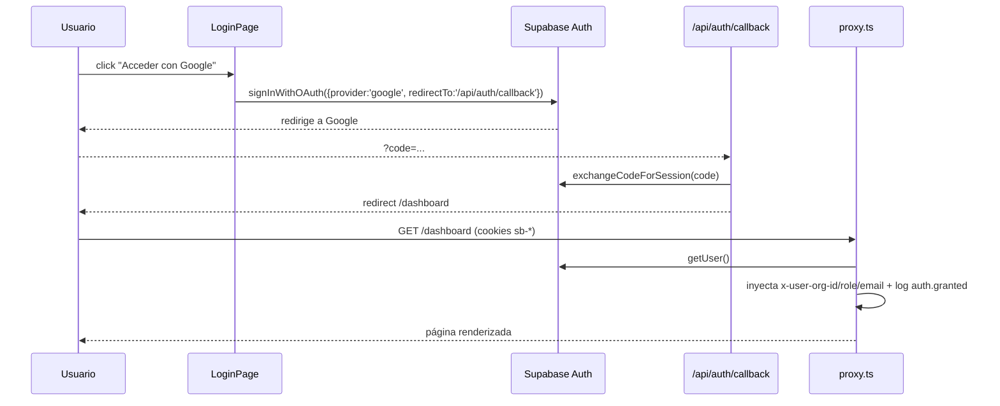
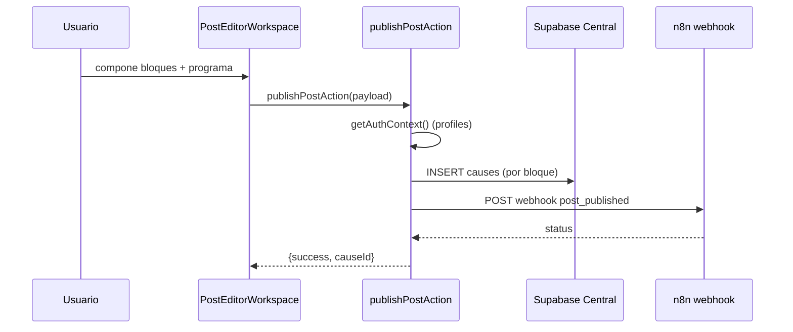
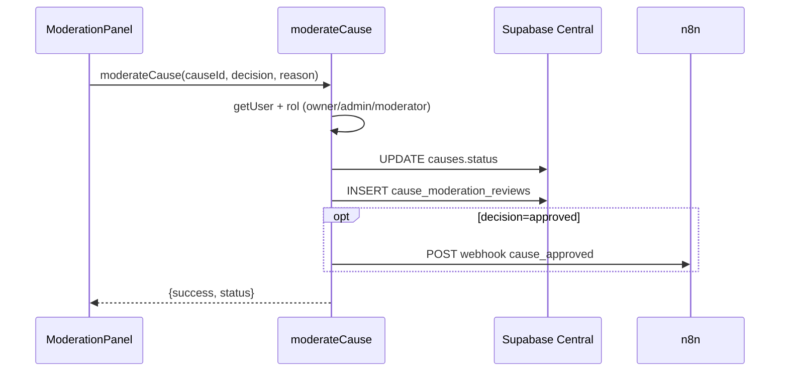
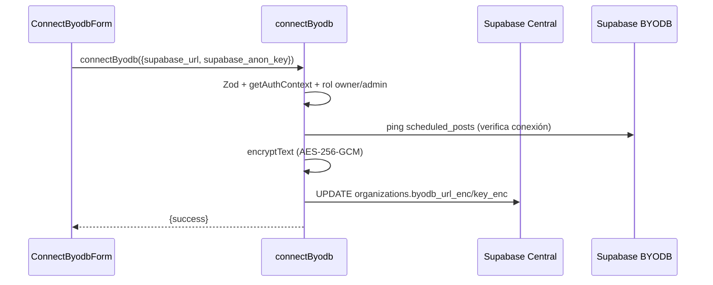
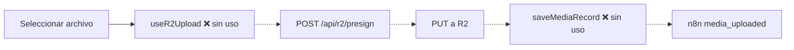

# Arquitectura del Proyecto — NUH (Auditoría V2)

> **Documento generado por auditoría técnica — modo solo lectura.**
> Esta es la **versión V2** de la fuente de verdad arquitectónica. **No sobrescribe** a
> `docs/ARQUITECTURA-PROYECTO.md` (auditoría previa), que se conserva como histórico.
> Distingue en todo momento `VERIFICADO`, `INFERIDO`, `NO ENCONTRADO` y `PENDIENTE DE VALIDACIÓN`.
>
> **Novedades respecto a la auditoría previa:** (1) se audita el working tree que ya incluye la
> capa de **observabilidad** (`lib/logger.ts`, `/api/health`, logging de auditoría) y la
> **reorganización de `handoffs/`** (marco "Cocina NUH"); (2) se re-verifican los hallazgos de
> seguridad P0 previos; (3) `npm audit` detecta ahora **advisories directos sobre Next.js 16.2.10**.

---

## Metadatos de auditoría

| Campo | Valor |
|---|---|
| Fecha de auditoría | 2026-08-18 |
| Rama analizada | `arena/01a01617-hun-v1-1-antigravity` |
| HEAD local | `c6dd873` (merge PR #32) — **con cambios sin commitear en el working tree** |
| Tip remoto de la rama | `d8c4fb7` (`observability: request/audit logging, health endpoint, logger + handoffs agents`) |
| Estado del working tree | Modificados: 5 actions + `proxy.ts` + `docker-compose.yml` + `handoffs/LEEME.md`; renombrados a `handoffs/mensajes/`; nuevos: `lib/logger.ts`, `app/api/health/`, `handoffs/agentes/**` |
| Remoto | `origin = https://github.com/BLK3Devilleo/HUN-V1.1-antigravity.git` |
| Profundidad del clone | **Shallow (depth=1)** — solo 1 commit visible localmente |
| Alcance | Análisis estático de la totalidad del repositorio (73 archivos: 62 rastreados + 11 nuevos) |
| Gestores detectados | npm (`package.json` + `package-lock.json`). No Python (`requirements.txt`/`pyproject.toml`/`poetry.lock`/`uv.lock`) — `NO ENCONTRADO` |
| Instrucciones para agentes | `AGENTS.md`, `CLAUDE.md` (=`@AGENTS.md`), `README.md`, `Homework.md`, `docs/*`, `handoffs/**`. No `CONTRIBUTING.md`, `.agents/`, `.github/` — `NO ENCONTRADO` |
| Verificaciones ejecutadas | `npm ci`, `npx tsc --noEmit`, `npx eslint .`, `npm run build`, `npm audit --omit=dev` (detalle en §Pruebas y calidad y Anexo E) |
| Limitaciones | (1) El build no completa por falta de salida de red a `fonts.googleapis.com` (next/font) — limitación del sandbox, no error de código. (2) No hay credenciales/entorno vivo: Supabase/R2/n8n no se validaron en ejecución. (3) Clone shallow limita el historial. (4) El commit de observabilidad existe en el remoto pero no como ref local (el entorno restaura archivos, no refs de git). |

### Nota sobre el estado de git (transparencia)

El working tree auditado **contiene el trabajo completo** (hardening de seguridad ya presente en
`main` + observabilidad + reorganización de handoffs). Ese trabajo está **commiteado en el remoto**
(`d8c4fb7`) y expuesto en el PR #33, pero **sin commitear en el checkout local** (el entorno de
sandbox persiste archivos, no refs de git). La auditoría se limita a los archivos; no se
realizaron commits ni cambios funcionales.

---

## Resumen ejecutivo

**Propósito (`VERIFICADO`):** NUH es una **web SaaS multi-tenant** para organizaciones (causas/ONGs
bajo "Build 4 Venezuela") que autentican, componen publicaciones multi-variación para redes sociales,
suben multimedia, moderan contenido y disparan la publicación automática a través de un orquestador
externo (**n8n**).

**Arquitectura resumida:** una única aplicación **Next.js 16 (App Router, `output: 'standalone'`)**
que actúa a la vez de frontend y backend (Server Actions + API Routes + `proxy.ts` como guardián de
red/autenticación). Persistencia en **Supabase Central** (tenant registry, usuarios, causas,
moderación) y **Supabase BYODB** (base privada por organización: posts programados, tokens sociales,
media, cola de publicación). Multimedia en **Cloudflare R2** (subida directa vía URL pre-firmada).
Publicación final delegada a **n8n** vía webhooks.

**Componentes críticos:**
1. `proxy.ts` — guardián de auth/autorización + inyección de cabeceras `x-user-*` + (nuevo) logging de auditoría.
2. `app/actions/*` — toda la lógica de negocio (publicar, moderar, conectar BYODB, configurar webhook).
3. `app/api/*` — callback OAuth, firma de subidas R2 y (nuevo) health check.
4. `lib/*` — `auth.ts` (contexto seguro), `crypto.ts` (AES-256-GCM), `r2.ts`, `supabase.ts`, `logger.ts` (nuevo).
5. `supabase/migrations/*.sql` — contratos de datos + RLS (Central y BYODB).
6. `components/dashboard/PostEditorWorkspace.tsx` (1974 líneas) — el componente más grande y de mayor fan-in/out.

**Riesgos principales:** (detalle en §Seguridad y §Deuda técnica)
- P1: autorización por cabeceras `x-user-*` como fuente de verdad en `/api/r2/presign` **y en las
  páginas servidor** (`feed/gallery/profile/admin/settings`) — S-04 no cerrado del todo.
- P1: Next.js 16.2.10 con **advisories high directos** (SSRF en Server Actions, bypass de proxy,
  DoS, payload no acotado) — requiere subir a 16.3.1.
- P1: flujo de subida de media **roto** (presign→R2→Supabase→n8n sin cablear a UI); dashboard con mocks.
- P1: programación multi-bloque recogida en UI pero **no transmitida** al backend.
- P2: 4 vulnerabilidades `high` transitivas (postcss/sharp vía next); lint rojo (18 errores); cero tests.

**Estado de salud general:** 🟡 **MVP en desarrollo.** Typecheck limpio, seguridad P0 cerrada,
observabilidad incorporada; pero hay flujos backend desconectados, autorización por cabecera
residual, lint rojo, dependencia de framework con advisories activas y cero cobertura de tests.

---

## Estado de verificación

| Categoría | Elementos |
|---|---|
| **VERIFICADO** | Estructura de 73 archivos; contenido de todos los `.ts/.tsx/.sql/.json/.yml/.md`; `package.json`/lock; `proxy.ts`; 3 API routes; 8 server actions; 5 módulos `lib/`; 1 hook; 10 componentes; 7 páginas; 2 migraciones; Dockerfile/compose; resultados reales de `eslint`, `tsc`, `build`, `npm audit` |
| **INFERIDO** | Historial real mayor que 1 commit (clone shallow). Despliegue a Dokploy (documentado, sin config en repo). postcss/sharp son dependencias **transitivas** de next |
| **PENDIENTE DE VALIDACIÓN** | Ejecución real contra Supabase Central/BYODB, R2 y n8n (credenciales); comportamiento en navegador; despliegue Dokploy/Docker; build completo con red a Google Fonts; RLS en Postgres real; explotabilidad de advisories de Next |
| **NO ENCONTRADO** | Backend Python/FastAPI; `tests/`; SSE/WebSockets; workers/cron propios; CI/CD (`.github/`); `.env*` commitado; `middleware.ts`; `instrumentation.ts`; secretos en el repo; `lib/types.ts` |

---

## Estructura del repositorio

`VERIFICADO` (árbol lógico; 73 archivos excluyendo `.git/`, `node_modules/`, `.next/`):

```
.
├── AGENTS.md, CLAUDE.md, README.md, Homework.md   # instrucciones / roadmap / invariantes
├── Dockerfile, docker-compose.yml, .dockerignore  # contenedorización
├── .gitignore, eslint.config.mjs, next.config.ts,
│   postcss.config.mjs, tsconfig.json              # build/lint/config
├── package.json, package-lock.json                # manifiesto npm
├── inventario_recursos_dependencias.csv          # inventario de recursos/deps
├── proxy.ts                                       # ⭐ capa de red / auth (Next 16)
├── UI/BKND.md                                     # spec backend (programación/cola)
├── app/  (App Router)
│   ├── layout.tsx, page.tsx, globals.css, favicon.ico
│   ├── (auth)/login/page.tsx
│   ├── (dashboard)/dashboard/{page,admin,feed,gallery,profile,settings}/…
│   │       └── admin/ModerationPanel.tsx, settings/WebhookSettingsForm.tsx
│   ├── actions/{byodb,dashboard,media,moderation,post,settings}.ts
│   └── api/{auth/callback,r2/presign,health}/route.ts   # ⭐ health es NUEVO
├── components/{ConnectByodbForm.tsx, dashboard/*.tsx}   # 10 componentes
├── hooks/useR2Upload.ts
├── lib/{auth,crypto,r2,supabase,logger}.ts        # ⭐ logger es NUEVO
├── handoffs/                                      # ⭐ REORGANIZADO (Cocina NUH)
│   ├── LEEME.md
│   ├── mensajes/{PLANTILLA,*.md}                  # ⭐ movido aquí
│   └── agentes/{HAR,HAG}/… + HAR/subagentes/COCINERO/  # ⭐ NUEVO
├── public/*.svg                                   # defaults create-next-app
├── supabase/migrations/{001_schema_central,002_schema_local_byodb}.sql
└── docs/{ARQUITECTURA-*,Auditoria-*,BITACORA-*,DISENO-*,PROTOCOLO-*}.md
```

### Clasificación de directorios (criticidad / estado)

| Ruta | Propósito | Tecnología | Criticidad | Estado |
|---|---|---|---|---|
| `proxy.ts` | Auth/autorización + headers + logging | Next 16 | 🔴 CRÍTICO | activo |
| `app/actions/` | Lógica de negocio (server actions) | TS `'use server'` | 🔴 CRÍTICO | activo (2 sin uso) |
| `app/api/` | Endpoints HTTP | Route handlers | 🔴 CRÍTICO | activo |
| `lib/` | Auth, cripto, R2, clientes, logger | TS | 🔴 CRÍTICO | activo |
| `supabase/migrations/` | Esquema + RLS | SQL/Postgres | 🔴 CRÍTICO | activo |
| `components/dashboard/` | UI "Don Emilio" | React 19 + framer-motion | 🟡 ALTO | activo (zona congelada) |
| `app/(dashboard)/` | Páginas/rutas | Next App Router | 🟡 ALTO | activo |
| `app/(auth)/login/` | Login OAuth | React | 🟡 ALTO | activo |
| `hooks/` | Hook de subida | TS | 🟢 MEDIO | **sin referencias** |
| `handoffs/` | Comunicación entre agentes | Markdown | 🟢 BAJO | documentación |
| `docs/`, `UI/`, `inventario_*.csv` | Documentación/specs | Markdown/CSV | 🟢 BAJO | documentación |
| `public/` | Assets estáticos | SVG | 🟢 BAJO | defaults sin uso |

---

## Tecnologías y dependencias

### Runtime y frameworks (`VERIFICADO`, `package.json`)

| Categoría | Detalle |
|---|---|
| Runtime | Node.js (`node:22-alpine` en Docker; sin campo `engines`). Sandbox: Node v22.x |
| Framework | **next 16.2.10** (exacto), React **19.2.4**, react-dom 19.2.4 |
| UI/animación | framer-motion ^12.42.2, lucide-react ^1.25.0 |
| Datos | @supabase/supabase-js ^2.110.7, @supabase/ssr ^0.12.3 |
| Storage | @aws-sdk/client-s3 ^3.1090.0, @aws-sdk/s3-request-presigner ^3.1090.0 |
| Formularios | react-hook-form ^7.81.0, @hookform/resolvers ^5.4.0, zod ^4.4.3 |
| Dev | tailwindcss ^4, @tailwindcss/postcss ^4, typescript ^5, @types/*, eslint ^9, eslint-config-next 16.2.10 |

### Vulnerabilidades (`npm audit --omit=dev`, `VERIFICADO` — ejecutado en esta auditoría)

**4 high severity vulnerabilities**, todas resueltas por `next` (fijado a 16.2.10):

1. **`next` (el framework mismo)** — múltiples advisories `high`:
   - `GHSA-89xv-2m56-2m9x` — **SSRF en Server Actions en servidores custom** (relevante: NUH usa Server Actions intensamente).
   - `GHSA-6gpp-xcg3-4w24` — bypass de Middleware/Proxy en App Router (Turbopack, single locale).
   - `GHSA-m99w-x7hq-7vfj` — DoS en App Router vía Server Actions.
   - `GHSA-4c39-4ccg-62r3` — payload de Server Action no acotado en Edge runtime.
   - `GHSA-955p-x3mx-jcvp` — disclosure no autenticado de endpoints internos de Server Function.
   - `GHSA-68g3-v927-f742` y `GHSA-4633-3j49-mh5q` — cache confusion de cuerpos de respuesta.
   - `GHSA-p9j2-gv94-2wf4` — SSRF en rewrites; `GHSA-q8wf-6r8g-63ch` — DoS en Image Optimization (SVG).
2. **`postcss <=8.5.22`** (transitiva vía next) — XSS en stringify + path traversal/lectura arbitraria de `.map`.
3. **`sharp <0.35.0`** (transitiva vía next) — libvips `CVE-2026-33327/33328/35590/35591`.

**Fix sugerido por npm:** `npm audit fix --force` → instala `next@16.3.1` (fuera del rango fijado `16.2.10`).
`INFERIDO`: no hay uso directo de postcss/sharp en código de app; el riesgo de los advisories de
`next` depende de la configuración de despliegue (custom server, Edge). Ver §Seguridad (N-01).

---

## Entrypoints y ejecución local

| Entrypoint | Comando | Runtime | Puerto | Env requeridas | Depende de | Inicializa |
|---|---|---|---|---|---|---|
| Dev server | `npm run dev` → `next dev` | Node | 3000 | Supabase/R2 (solo features) | Supabase Central (auth) | HMR + App Router |
| Build | `npm run build` → `next build` | Node | — | `NEXT_PUBLIC_SUPABASE_*`, `NEXT_PUBLIC_APP_URL` | red a Google Fonts (next/font) | compila standalone |
| Prod server | `npm run start` → `next start` | Node | `PORT` (3357) | todas (Anexo D) | Supabase, R2, n8n | sirve `.next` |
| Docker | `docker-compose up` / `Dockerfile` | node:22-alpine | **3357** | build args + env | Supabase, R2, n8n | `CMD ["node","server.js"]` |
| Lint | `npm run lint` | Node | — | — | — | eslint |

- **No hay** CLI, workers, cron, consumers de colas ni funciones serverless propias — `NO ENCONTRADO`.
- El único "proceso asíncrono" es el **webhook saliente fire-and-forget a n8n** (dentro de server actions).
- Migraciones: SQL manuales (`supabase/migrations/*.sql`), sin runner automático.

---

## Arquitectura de alto nivel

```mermaid
flowchart LR
  subgraph Client["Cliente (navegador)"]
    UI["React 19 / Next.js 16 App Router<br/>Dashboard 'Don Emilio'"]
  end
  subgraph Next["Aplicación Next.js (standalone, :3357)"]
    PX["proxy.ts<br/>auth + cabeceras x-user-* + auditoría"]
    SA["Server Actions<br/>post / media / moderation / byodb / settings / dashboard"]
    API["API Routes<br/>/api/auth/callback<br/>/api/r2/presign<br/>/api/health (nuevo)"]
    LIB["lib/<br/>auth · crypto · r2 · supabase · logger(nuevo)"]
  end
  SC["Supabase Central<br/>organizations · profiles · causes · cause_moderation_reviews"]
  SB["Supabase BYODB (por tenant)<br/>scheduled_posts · social_tokens · media_files · publish_queue · webhook_events"]
  R2["Cloudflare R2<br/>(presigned upload ≤500MB)"]
  N8N["n8n webhook<br/>(publicación en redes)"]
  GA["Google OAuth (Supabase Auth)"]

  UI -->|peticiones| PX
  PX --> SA
  PX --> API
  SA --> LIB
  API --> LIB
  LIB -->|SELECT/INSERT/UPDATE| SC
  LIB -->|queries locales (x-org-id)| SB
  LIB -->|presigned URL| R2
  SA -->|POST webhook| N8N
  UI -->|PUT directo| R2
  UI -->|signInWithOAuth| GA
  GA -->|callback| API
```

> **Qué representa:** flujo de peticiones navegador → proxy (auth) → actions/rutas → 4 servicios externos.
> **Limitaciones:** no muestra cookies de sesión, el cifrado interno BYODB, ni que
> `getDashboardData`/`saveMediaRecord`/`useR2Upload` están desconectados.

---

## Backend y servicios

No hay backend separado (Python/FastAPI `NO ENCONTRADO`). El backend es **Next.js**:

### `proxy.ts` (capa de red / guardián)

- `config.matcher` excluye `_next/static`, `_next/image`, `favicon.ico`, assets estáticos.
- Intercepta: `/` y `/dashboard/*` (dashboard) y `/api/*` **salvo `/api/auth/*` y `/api/health/*`** (nuevo).
- Flujo (`VERIFICADO`):
  1. `createServerClient` (`@supabase/ssr`) con adaptador de cookies.
  2. `supabase.auth.getUser()`.
  3. Sin usuario → si `ALLOW_DEV_BYPASS==='true'` **y** localhost: inyecta `org-1`/`admin`; si no: redirect `/login`.
  4. Con usuario → con `SUPABASE_CENTRAL_SERVICE_ROLE_KEY` consulta `profiles(org_id, role)` e inyecta `x-user-org-id`, `x-user-role`, `x-user-email`.
  5. Sin service key o fallo de `profiles` → **deniega** (redirect `/login?error=...`), sin escalada.
- **NUEVO (observabilidad):** calcula `clientIp` (`x-forwarded-for`/`x-real-ip`), `method`, `pathname`,
  `startedAt`; emite `auth.dev_bypass` (warn), `auth.redirect_login` (info), `auth.denied`
  (error/warn) y `auth.granted` (info, con `dur_ms`).
- `getSafeRedirectUrl()`: URLs seguras (localhost vs `NEXT_PUBLIC_APP_URL` vs `x-forwarded-host`).

### Server Actions (`app/actions/`, `'use server'`)

| Archivo | Símbolos exportados | Estado |
|---|---|---|
| `byodb.ts` | `ConnectByodbSchema/Input`, `ActionResult`, `connectByodb()`, `getByodbStatus()` | usado (settings) |
| `dashboard.ts` | `DashboardPost/Org/DataResult`, `getDashboardData()` | **sin uso** |
| `media.ts` | `saveMediaRecord()` | **sin uso** |
| `moderation.ts` | `moderateCause()` | usado (admin) |
| `post.ts` | `PublishPostPayload`, `publishPostAction()` | usado (editor) |
| `settings.ts` | `saveN8nWebhook()`, `getN8nWebhook()` | usado (settings) |

**NUEVO (observabilidad):** cada acción con eventos `action.*` (`publish.start/.ok/.failed`,
`moderate.start/.ok/.failed`, `byodb_connect.start/.ok/.denied`, `webhook_save.start/.ok/.denied`,
`media_save.start/.ok/.failed`).

### API Routes

| Ruta | Método | Controlador | Descripción |
|---|---|---|---|
| `/api/auth/callback` | GET | `GET()` | `exchangeCodeForSession(code)` → redirect (sanitiza `next` a rutas relativas) |
| `/api/r2/presign` | POST | `POST()` | presigned URL (auth por header `x-user-org-id`) |
| `/api/health` | GET | `GET()` | **NUEVO** — presencia de env vars + `missing_config` + uptime |

### lib/ (conectores)

| Archivo | Exporta | Acceso externo |
|---|---|---|
| `lib/auth.ts` | `getAuthContext()`, `AuthContext` | valida sesión contra `profiles` (no headers) |
| `lib/crypto.ts` | `encryptText`, `decryptText` (AES-256-GCM) | `BYODB_ENCRYPTION_KEY \|\| ENCRYPTION_SECRET` |
| `lib/r2.ts` | `generatePresignedUploadUrl`, `PresignedUrlResult` | R2 (S3 API), `R2_*` env |
| `lib/supabase.ts` | `createBrowserClient`, `createLocalClient` | Supabase Central + BYODB |
| `lib/logger.ts` | `logger` (debug/info/warn/error) | **NUEVO** — stdout, `LOG_LEVEL`, redacta secretos |

---

## Frontend e interfaz

### Sistema de rutas (`VERIFICADO`)

| Ruta | Tipo de render | Fuente de datos |
|---|---|---|
| `/` | Server | `redirect('/dashboard')` |
| `/login` | Client | Supabase Auth (OAuth Google) |
| `/dashboard` | Client (672 l) | **estado local / mocks** |
| `/dashboard/feed` | Server (`revalidate=60`) | `causes` (approved) + join `organizations` |
| `/dashboard/gallery` | Server | `causes` de la org (header `x-user-org-id`) |
| `/dashboard/profile` | Server | cabeceras `x-user-*` |
| `/dashboard/settings` | Server | `getByodbStatus()` + forms + headers |
| `/dashboard/admin` | Server | rol-gate por header + `causes` pendientes |

### Componentes (`components/dashboard/`)

| Componente | Líneas | Función | APIs |
|---|---|---|---|
| `PostEditorWorkspace` | 1974 | editor multi-bloque + calendario | `publishPostAction` (dynamic import) |
| `ConversationsSidebar` | 286 | navegación de proyectos/orgs | — |
| `SocialSidebar` | 273 | navegación lateral | `Link` |
| `GalleryWorkspace` | 228 | galería | — |
| `ConnectByodbForm` | 224 | conectar BYODB | `connectByodb` |
| `ModerationPanel` | 226 | moderación | `moderateCause` |
| `UploadQueueWidget` | 152 | cola de subida (visual) | — |
| `FeedGrid` | 137 | feed | `next/image`, `Link` |
| `ContentStack` | 114 | stack de contenido | — |
| `WebhookSettingsForm` | 103 | configurar webhook | `saveN8nWebhook`/`getN8nWebhook` |
| `FolderCard` / `StorageBar` | 56 / 41 | UI | — |

### Hooks

| Hook | Archivo | Consumidor |
|---|---|---|
| `useR2Upload` | `hooks/useR2Upload.ts` | ❌ **nadie** (flujo de subida no cableado) |

### Riesgos de render/frontend (`VERIFICADO` por lint)

- `react-hooks/set-state-in-effect` (login y PostEditorWorkspace) → cascadas de render.
- `react-hooks/purity` (`Date.now()` en render, PostEditorWorkspace:772) → render no determinista.
- `@next/next/no-img-element` (4 ocurrencias) → LCP/bandwidth.
- Estado de programación calculado en UI pero **no enviado** al publicar (ver §Flujos).

---

## Modelos de datos y persistencia

### Persistencia detectada

| Recurso | Tecnología | Propietario |
|---|---|---|
| Supabase Central | Postgres + Auth (`NEXT_PUBLIC_SUPABASE_CENTRAL_URL`, anon + service role) | Plataforma NUH |
| Supabase BYODB | Postgres (instancia cliente), credenciales cifradas en `organizations.byodb_*_enc` | Organización |
| Cloudflare R2 | Object storage S3 (`R2_*` env) | Plataforma (por org vía path) |
| Cookies de sesión | `@supabase/ssr` (`sb-*`) | Supabase Auth |
| Memoria local | `URL.createObjectURL`, `useState` | efímera |

`NO ENCONTRADO`: localStorage/sessionStorage/IndexedDB, caché propia, Redis.

### Esquema Central (`001_schema_central.sql`, 287 l) — `VERIFICADO`

- **organizations**: `id, name, slug, plan, byodb_url_enc, byodb_key_enc, is_active, settings(JSONB), …`.
- **profiles**: `id(PK→auth.users), org_id, email, full_name, avatar_url, role(owner/admin/member/moderator), is_active, …`.
- **causes**: `id, org_id, creator_id, title, description, category, cta_text, cta_url, media_url, status(draft/pending_moderation/approved/rejected/archived), rejection_reason, moderation_score, hashtags[], total_shares, …`.
- **cause_moderation_reviews**: `id, cause_id, moderator_id, decision, checklist, notes, ai_analysis, …`.
- Funciones: `set_updated_at`, `handle_new_auth_user`, `get_causes_feed`, `on_cause_shared`, **`get_my_org_id()`, `get_my_role()` (SECURITY DEFINER — fix anti-recursión)**; vista `moderation_queue`.

### Esquema BYODB (`002_schema_local_byodb.sql`, 265 l) — `VERIFICADO`

- **scheduled_posts**, **social_tokens**, **media_files**, **publish_queue**, **webhook_events**.
- Trigger `on_post_scheduled` (crea filas en `publish_queue` por plataforma); vista `n8n_pending_queue`.
- RLS por org vía `request.headers->>'x-org-id'`; `webhooks_service_only` con `USING(false)`.

---

## API y contratos

### Endpoints HTTP

| ID | Método | Ruta | Auth | Validación | Consumidores | Estado |
|---|---|---|---|---|---|---|
| E-01 | GET | `/api/auth/callback` | callback OAuth | sanitiza `next` | Supabase OAuth | usado |
| E-02 | POST | `/api/r2/presign` | header `x-user-org-id` | Zod `PresignSchema` | `useR2Upload` (❌) | **posiblemente sin uso** |
| E-03 | GET | `/api/health` | **ninguna** (excluida del guard) | — | healthcheck Docker | **nuevo** |

### Server Actions (RPC)

| ID | Acción | Auth | Consumidor | Estado |
|---|---|---|---|---|
| A-01 | `connectByodb` | `getAuthContext` + rol owner/admin | `ConnectByodbForm` | usado |
| A-02 | `getByodbStatus` | `getAuthContext` | `settings/page.tsx` | usado |
| A-03 | `moderateCause` | `getUser` + rol | `ModerationPanel` | usado |
| A-04 | `publishPostAction` | `getAuthContext` | `PostEditorWorkspace` | usado |
| A-05 | `saveN8nWebhook` | `getAuthContext` + owner/admin | `WebhookSettingsForm` | usado |
| A-06 | `getN8nWebhook` | `getAuthContext` | `WebhookSettingsForm` | usado |
| A-07 | `getDashboardData` | header org | ❌ nadie | **sin uso** |
| A-08 | `saveMediaRecord` | usuario + perfil | ❌ nadie | **sin uso** |

### Webhooks salientes (→ n8n)

| ID | Evento | Productor | Estado |
|---|---|---|---|
| W-01 | `media_uploaded` | `saveMediaRecord` | ❌ productor sin uso |
| W-02 | `post_published` | `publishPostAction` | activo |
| W-03 | `cause_approved` | `moderateCause` | activo |

`NO ENCONTRADO`: SSE, WebSocket, GraphQL, polling, webhooks entrantes (`/api/n8n/callback` no existe).

### Matriz de consistencia (resumen)

| Divergencia | Evidencia | Impacto |
|---|---|---|
| Endpoints/acciones sin consumidor | `useR2Upload`, `saveMediaRecord`, `getDashboardData` | código muerto / flujo de subida roto |
| UI con mocks | `INITIAL_PROJECTS` (dashboard), métricas hardcodeadas | datos inconsistentes |
| Programación no enviada | `UI/BKND.md` define `blocks[]/scheduledTimestamp`; payload no lo transmite | programación no funcional |
| Tipos dispersos | sin `lib/types.ts`; tipos en cada componente | duplicación |
| Enums DB vs UI | `status` de `causes` en SQL vs `item.status: string` | pérdida de seguridad de tipos |

---

## Estado y comunicación entre módulos

- **Sin estado global** (sin Context/Redux/Zustand/React Query). Todo `useState` + prop drilling.
- **Prop drilling** intenso entre `dashboard/page.tsx` y sus hijos.
- **Duplicación**: `isUuid()` y `getAdminClient()` repetidos en `post.ts` y `settings.ts`.
- **Mocks duplicados**: `MOCK_ORGANIZATIONS` (dashboard.ts) y `DEFAULT_MOCK_PROJECTS` (ConversationsSidebar).
- **Imports dinámicos**: `publishPostAction` vía `await import('@/app/actions/post')`.
- **`any`**: 12 ocurrencias (`catch (error: any)` y props de callbacks).
- **Acoplamiento con cabeceras**: las páginas servidor leen `x-user-*` (ver §Seguridad N-02).

---

## Integraciones externas

| Integración | Contrato | Estado |
|---|---|---|
| Supabase Auth (Google OAuth) | `signInWithOAuth`, `exchangeCodeForSession`, `getUser` | VERIFICADO código / PENDIENTE runtime |
| Supabase Central | tablas centrales | VERIFICADO |
| Supabase BYODB | migración 002 + `createLocalClient` | VERIFICADO esquema / PENDIENTE uso real |
| Cloudflare R2 | presigned PUT, MIME whitelist, ≤500MB, path `orgs/{orgId}/{ts}_{name}` | VERIFICADO código / sin consumidor UI |
| n8n | webhooks `post_published`/`cause_approved`/`media_uploaded` | solo 2 de 3 se disparan |
| Google Fonts (next/font) | build-time fetch Inter/Anton/Barlow | causa del fallo de build en sandbox |
| Telegraf (cdnfonts) | CSS `@import` en `globals.css` | runtime navegador |

---

## Infraestructura, configuración y despliegue

- **Dockerfile**: multi-stage, `node:22-alpine`, `output:'standalone'`, usuario no-root `nextjs` (uid 1001), `EXPOSE 3357`, `CMD ["node","server.js"]`.
- **docker-compose.yml**: servicio `hun-frontend` (:3357), build args + environment, `restart: always`,
  logging `json-file` (10m×3), **NUEVO** `LOG_LEVEL=${LOG_LEVEL:-info}` y `healthcheck` vía `wget`.
- **CI/CD**: `NO ENCONTRADO` (sin `.github/`, Actions, K8s, Terraform). Despliegue `INFERIDO` a Dokploy
  (documentado en `BITACORA_IA_EMILIO.md`, que menciona un bug 502 y exigía `middleware.ts` — el repo usa `proxy.ts`).
- **Observabilidad**: **NUEVO** logger estructurado + `/api/health` + healthcheck. Aún **sin** métricas,
  trazas, dashboards, alertas ni correlation IDs.

### Variables de entorno (Anexo D — nombres únicamente)

`NEXT_PUBLIC_SUPABASE_CENTRAL_URL`, `NEXT_PUBLIC_SUPABASE_CENTRAL_ANON_KEY`,
`SUPABASE_CENTRAL_SERVICE_ROLE_KEY` (alias `SUPABASE_SERVICE_ROLE_KEY`), `NEXT_PUBLIC_APP_URL`,
`R2_ACCOUNT_ID`, `R2_ACCESS_KEY_ID`, `R2_SECRET_ACCESS_KEY`, `R2_BUCKET_NAME`, `NEXT_PUBLIC_R2_PUBLIC_URL`,
`BYODB_ENCRYPTION_KEY` (alias `ENCRYPTION_SECRET`), `N8N_WEBHOOK_URL`, `ALLOW_DEV_BYPASS`,
`LOG_LEVEL` (nueva), `NODE_ENV`, `PORT`, `HOSTNAME`, `NEXT_TELEMETRY_DISABLED`.

`VERIFICADO`: no hay `.env*` commitado; no se exponen secretos en el repo.

---

## Seguridad

### Hallazgos previos (re-verificados en esta auditoría)

| ID | Hallazgo | Estado actual |
|---|---|---|
| S-01 | Bypass de auth en localhost | ✅ **CERRADO** — `ALLOW_DEV_BYPASS==='true'` explícito + localhost |
| S-02 | Escalada a rol `owner` | ✅ **CERRADO** — fail-closed, sin escalada |
| S-03 | Recursión RLS en `profile_org_admin_select` | ✅ **CERRADO** — `get_my_org_id()/get_my_role()` `SECURITY DEFINER` |
| S-04 | Autorización por cabecera `x-user-org-id` | 🟠 **PARCIAL** — persiste en `/api/r2/presign` y páginas (N-02) |
| S-05 | `orgId` del cliente con fallback | ✅ **CERRADO** — `getAuthContext()` server-side |
| S-06 | MIME whitelist sin verificación de contenido/antivirus | 🟡 ABIERTO (P2) |
| S-07 | Callback OAuth con redirect abierto | 🟡 MITIGADO — `next` sanitizado a rutas relativas |
| S-08 | Cifrado BYODB en Node vs `pgcrypto` del esquema | 🟡 ABIERTO (P2, incoherencia de diseño) |
| S-09 | n8n necesita service_role (bypass RLS) | ⚪ informativo (P3) |

### Hallazgos NUEVOS de esta auditoría

| ID | Hallazgo | Prioridad |
|---|---|---|
| **N-01** | **Next.js 16.2.10 con advisories `high` directos** (SSRF en Server Actions, bypass de proxy, DoS, payload no acotado). Fix: `next@16.3.1` | **P1** |
| **N-02** | **Páginas servidor leen `x-user-*` como fuente de verdad** (`feed/gallery/profile/admin/settings` vía `next/headers`) — S-04 extendido | **P1** |
| N-03 | Fallback de rol `admin` en desarrollo (`NODE_ENV==='development'`) en `profile/admin/settings` | P3 |
| N-04 | `healthcheck` usa `wget`, que puede no estar en `node:22-alpine` | P3 |
| N-05 | `/api/health` devuelve `200` aunque falte configuración (readiness semántica) | P2 |
| N-06 | `console.*` residual (6) en `dashboard.ts`, `media.ts`, `moderation.ts` (observabilidad incompleta) | P3 |

`NO ENCONTRADO`: rate limiting, CORS config, CSRF tokens, sanitización XSS de captions antes del
webhook, verificación de path traversal (sí sanitiza nombre de archivo en `lib/r2.ts`).

---

## Activos, recursos y almacenamiento

- `public/`: solo SVGs por defecto de create-next-app. Sin assets de marca. `VERIFICADO`.
- **No hay** `assets/`, `uploads/`, `media/`, `storage/`, fixtures, seeds ni prompts.
- Multimedia vive en **R2** (`orgs/{orgId}/{ts}_{sanitizedName}`); no versionado en Git.
- **Datos semilla en producción**: `INITIAL_PROJECTS`, `DEFAULT_MOCK_PROJECTS`, `MOCK_ORGANIZATIONS`.
- Documentación: `docs/` (6 archivos), `UI/BKND.md`, `inventario_recursos_dependencias.csv`.

### Brechas entre capas

| Capa | Estado | Brecha |
|---|---|---|
| Disco (repo) | 0 assets media | — |
| BBDD | `causes.media_url` + `media_files` | vacío hasta cablear subida |
| API | `POST /api/r2/presign` | sin consumidor |
| UI dashboard | mocks locales | no refleja BD |
| UI gallery/feed/admin | consulta Supabase | coherente |

---

## Pruebas y calidad

### Verificaciones ejecutadas (esta auditoría)

| Comando | Dir | Exit | Resultado |
|---|---|---|---|
| `npm ci` | raíz | **0** | dependencias instaladas |
| `npx tsc --noEmit` | raíz | **0** | ✅ Typecheck limpio |
| `npx eslint .` | raíz | **1** | ❌ 40 problemas (**18 errores, 22 warnings**) |
| `npm run build` | raíz | **1** | ❌ `next/font` (fetch Google Fonts bloqueado) — limitación de red |
| `npm audit --omit=dev` | raíz | 1 | 4 high (next + postcss + sharp) |
| tests | — | — | **No hay** (sin script `test`, sin `*.test.*`/`*.spec.*`) |

### Errores de lint (18 errores, por regla)

| Regla | Cantidad |
|---|---|
| `@typescript-eslint/no-explicit-any` | 12 |
| `react-hooks/set-state-in-effect` | 2 |
| `react/no-unescaped-entities` | 2 |
| `prefer-const` | 1 |
| `react-hooks/purity` (Date.now) | 1 |

Warnings (22): `no-unused-vars` (17), `no-img-element` (4), `exhaustive-deps` (1).

### Calidad de código

- **TODO/FIXME/HACK/XXX reales**: `NO ENCONTRADO` (los 8 matches son falsos positivos: "Todos", placeholder `xxx.supabase.co`).
- **Código muerto**: `useR2Upload`, `saveMediaRecord`, `getDashboardData`.
- **Componente monolítico**: `PostEditorWorkspace.tsx` = 1974 líneas.
- **Duplicación**: `isUuid`/`getAdminClient`; boilerplate de cliente Supabase repetido en acciones.
- **Mocks en producción**; **sin paginación** (límites fijos 100/30).
- **Errores**: `catch (error: any)` amplios; sin retry en webhooks (fire-and-forget).

---

## Flujos funcionales principales

### Flujo: Autenticación (login)



- **Verificación**: validado por código ✅ / test ❌ / entorno ⏳.
- **Riesgo**: redirect `next` (mitigado a rutas relativas); fallback de rol en dev (N-03).
- **Archivos**: `app/(auth)/login/page.tsx`, `app/api/auth/callback/route.ts`, `proxy.ts`.

### Flujo: Publicación (editor → n8n)



- **Riesgo**: el payload **no transmite** `blocks[]/scheduledTimestamp` definidos en `UI/BKND.md` →
  la programación no llega a n8n (P1). Sin retry en webhook.
- **Archivos**: `components/dashboard/PostEditorWorkspace.tsx`, `app/actions/post.ts`, `UI/BKND.md`.

### Flujo: Moderación



- **Verificación**: validado por código ✅ / test ❌ / entorno ⏳.
- **Archivos**: `app/(dashboard)/dashboard/admin/ModerationPanel.tsx`, `app/actions/moderation.ts`.

### Flujo: Conexión BYODB



- **Verificación**: validado por código ✅ / entorno ⏳ (solo `connectByodb` hace ping real).
- **Archivos**: `components/ConnectByodbForm.tsx`, `app/actions/byodb.ts`, `lib/crypto.ts`, `lib/supabase.ts`.

### Flujo: Subida de media (ROTO)



- **Estado**: **no cableado**. El dashboard maneja archivos con `URL.createObjectURL` (efímero) y no
  persiste. `useR2Upload` → `/api/r2/presign` → `saveMediaRecord` están desconectados (P1).
- **Archivos**: `hooks/useR2Upload.ts`, `app/api/r2/presign/route.ts`, `app/actions/media.ts`, `app/(dashboard)/dashboard/page.tsx`.

---

## Grafo de impacto y guía de cambios

| Cambio en | Puede afectar a | Motivo | Riesgo | Verificaciones |
|---|---|---|---|---|
| `proxy.ts` | todas las rutas protegidas + headers `x-user-*` | guardián único | 🔴 Alto | tsc + build + login manual |
| `app/actions/post.ts` | editor, Supabase Central, n8n | flujo de publicación | 🔴 Alto | tsc + flujo publicar |
| `lib/auth.ts` | todas las acciones que usan `getAuthContext` | fuente de verdad auth | 🔴 Alto | tsc + auth |
| Migraciones SQL | todas las tablas + RLS | contrato de datos | 🔴 Alto | aplicar en Supabase + test |
| `lib/supabase.ts` | clientes Central/BYODB | conexiones | 🟠 Medio | tsc + ping |
| `lib/logger.ts` | proxy + acciones | observabilidad | 🟢 Bajo | tsc |
| `components/dashboard/*` | UI (zona congelada) | no tocar sin contrato | 🔴 Alto | revisión de Don Emilio |
| Variables de entorno | build + runtime | faltan = fallos en prod | 🟠 Medio | health endpoint |

---

## Deuda técnica y riesgos

Registro priorizado (formato resumido; detalle en §Seguridad y §Matriz de consistencia):

| ID | Categoría | Hallazgo | Prioridad |
|---|---|---|---|
| N-01 | Seguridad | Next 16.2.10 advisories high (SSRF/DoS/bypass) | P1 |
| N-02 | Seguridad | auth por cabeceras en páginas + presign | P1 |
| F-01 | Backend | flujo de subida media roto | P1 |
| F-02 | Backend | programación no transmitida a n8n | P1 |
| F-03 | Datos | dashboard con mocks en producción | P1 |
| S-06 | Seguridad | sin verificación de contenido/antivirus en subidas | P2 |
| S-08 | Seguridad | cifrado Node vs pgcrypto (incoherencia) | P2 |
| N-05 | Observabilidad | health siempre 200 (readiness) | P2 |
| Q-01 | Calidad | lint rojo (18 errores) | P2 |
| Q-02 | Calidad | cero tests | P2 |
| D-01 | Datos | tipos dispersos sin `lib/types.ts` | P2 |
| N-03/N-04/N-06/S-09 | Varios | fallback rol dev; wget en healthcheck; console residual; n8n service_role | P3 |

---

## Recomendaciones priorizadas

### P0 — ninguna abierta (las tres P0 previas están cerradas ✅)

### P1 — inmediatas
1. **Subir Next.js a 16.3.1** (cierra advisories de SSRF/DoS/bypass). Dependencia previa: verificar
   compatibilidad de `@supabase/ssr` y re-test de build. *Validación:* `tsc` + `build` + smoke login.
2. **Eliminar auth por cabeceras** en páginas (`feed/gallery/profile/admin/settings`) y en
   `/api/r2/presign`: reutilizar `getAuthContext()` server-side. *Riesgo de no actuar:* escalado
   horizontal/forja de org_id.
3. **Cablear el flujo de subida de media** (hook → presign → R2 → `saveMediaRecord`) o eliminar el
   código muerto si no se prioriza.
4. **Transmitir la programación** (`blocks[]/scheduledTimestamp`) en `publishPostAction` según `UI/BKND.md`.
5. **Conectar el dashboard a datos reales** (`getDashboardData`) y retirar mocks.

### P2 — estabilización
- Verificación de contenido en subidas (S-06); decidir cifrado Node vs `pgcrypto` (S-08);
  readiness 503 en `/api/health` (N-05); limpiar lint; añadir suite mínima de tests; centralizar
  tipos en `lib/types.ts`.

### P3 — hardening
- Fallback de rol en dev (N-03); healthcheck sin `wget` (N-04); completar migración de `console.*`
  a logger (N-06); documentar entrega de service_role a n8n (S-09).

---

## Roadmap técnico recomendado

1. **Acciones inmediatas (P1):** upgrade Next; revalidación de auth server-side; cableado de subida.
2. **Estabilización:** tests, contratos (`lib/types.ts`), observabilidad completa, deuda crítica.
3. **Evolución:** modularizar `PostEditorWorkspace`; implementar aprovisionamiento BYODB
   (`docs/DISENO-BYODB-PROVISIONAMIENTO.md`).
4. **Optimización:** paginación, caché, retries de webhooks, CI/CD.

---

## Anexo A — Inventario detallado de archivos

`VERIFICADO`. 73 archivos (62 rastreados + 11 nuevos). Detalle por dominio:

- **Backend/red**: `proxy.ts` (169 l), `app/api/auth/callback/route.ts` (70), `app/api/r2/presign/route.ts` (42), `app/api/health/route.ts` (NUEVO, ~30).
- **Server Actions**: `post.ts` (304), `byodb.ts` (188), `settings.ts` (149), `dashboard.ts` (142), `moderation.ts` (104), `media.ts` (104).
- **lib/**: `auth.ts` (61), `crypto.ts` (58), `r2.ts` (83), `supabase.ts` (35), `logger.ts` (NUEVO, ~48).
- **Páginas**: `dashboard/page.tsx` (672), `settings/page.tsx` (200), `admin/ModerationPanel.tsx` (226), `login/page.tsx` (153), `profile/page.tsx` (113), `admin/page.tsx` (102), `feed/page.tsx` (91), `gallery/page.tsx` (84).
- **Componentes**: `PostEditorWorkspace.tsx` (1974), `ConversationsSidebar.tsx` (286), `SocialSidebar.tsx` (273), `GalleryWorkspace.tsx` (228), `ConnectByodbForm.tsx` (224), `UploadQueueWidget.tsx` (152), `FeedGrid.tsx` (137), `ContentStack.tsx` (114), `WebhookSettingsForm.tsx` (103), `FolderCard.tsx` (56), `StorageBar.tsx` (41).
- **Migraciones**: `001_schema_central.sql` (287), `002_schema_local_byodb.sql` (265).
- **Config**: `Dockerfile`, `docker-compose.yml` (45), `next.config.ts`, `tsconfig.json`, `eslint.config.mjs`, `postcss.config.mjs`, `.gitignore`, `.dockerignore`.
- **Handoffs (NUEVO)**: `LEEME.md`, `mensajes/{PLANTILLA,2 mensajes}`, `agentes/{HAR,HAG}/{SYSTEM-PROMPT,SEGUIMIENTO}.md`, `agentes/HAR/subagentes/COCINERO/{SYSTEM-PROMPT,SEGUIMIENTO}.md`.
- **Docs**: `ARQUITECTURA-PROYECTO.md` (histórico), `ARQUITECTURA-FILO-STUDIO.md`, `Auditoria-Micro-Detalles-V2.md`, `BITACORA_IA_EMILIO.md`, `DISENO-BYODB-PROVISIONAMIENTO.md`, `PROTOCOLO_FRONTEND_BACKEND.md`.

## Anexo B — Endpoints y eventos

| ID | Tipo | Ruta/evento | Productor/Controlador | Auth | Estado |
|---|---|---|---|---|---|
| E-01 | GET | `/api/auth/callback` | route `GET()` | callback | usado |
| E-02 | POST | `/api/r2/presign` | route `POST()` | header org | sin consumidor |
| E-03 | GET | `/api/health` | route `GET()` | ninguna | nuevo |
| W-02 | webhook | `post_published` | `publishPostAction` | — | activo |
| W-03 | webhook | `cause_approved` | `moderateCause` | — | activo |
| W-01 | webhook | `media_uploaded` | `saveMediaRecord` | — | sin uso |

## Anexo C — Tipos, modelos y contratos

- `ContentVariationBlock`, `ProjectDraft`, `SelectedMedia`, `PostEditorWorkspaceProps` (PostEditorWorkspace).
- `ProjectItem`, `ConversationsSidebarProps`; `FeedCause`, `MediaItem`; `FolderCardProps`, `StorageBarProps`, `UploadQueueWidgetProps`.
- `PresignedUrlResult` (lib/r2); `AuthContext` (lib/auth).
- `PublishPostPayload`, `VariationBlockPayload` (post); `ConnectByodbInput`, `ActionResult` (byodb); `DashboardPost/Org/DataResult` (dashboard).
- Enums SQL: `plan`, `role`, `category`, `status` (central); `status`, `origin`, `platform` (BYODB).

## Anexo D — Variables de entorno (nombres únicamente)

Ver §Infraestructura. Obligatorias en runtime: `NEXT_PUBLIC_SUPABASE_CENTRAL_URL`,
`NEXT_PUBLIC_SUPABASE_CENTRAL_ANON_KEY`, `SUPABASE_CENTRAL_SERVICE_ROLE_KEY` (o alias), `NEXT_PUBLIC_APP_URL`.
Opcionales condicionadas: `R2_*`, `BYODB_ENCRYPTION_KEY` (o alias), `N8N_WEBHOOK_URL`, `ALLOW_DEV_BYPASS`, `LOG_LEVEL`.
Sin fallback para las críticas → si faltan, `proxy.ts`/acciones deniegan (fail-closed).

## Anexo E — Comandos de verificación

| Comando | Exit | Nota |
|---|---|---|
| `npm ci` | 0 | 411+ paquetes |
| `npx tsc --noEmit` | 0 | limpio |
| `npx eslint .` | 1 | 18 errores / 22 warnings |
| `npm run build` | 1 | next/font sin red a Google Fonts |
| `npm audit --omit=dev` | 1 | 4 high |

## Anexo F — Elementos pendientes de validación

- Ejecución real contra Supabase Central/BYODB, R2 y n8n.
- Comportamiento en navegador (hydration, framer-motion, programación).
- Despliegue Dokploy/Docker + healthcheck `wget`.
- Build completo con red a Google Fonts.
- RLS en Postgres real.
- Explotabilidad de advisories de Next (depende de custom server/Edge).
- Efectividad de `get_my_org_id()`/`get_my_role()` contra recursión RLS.
