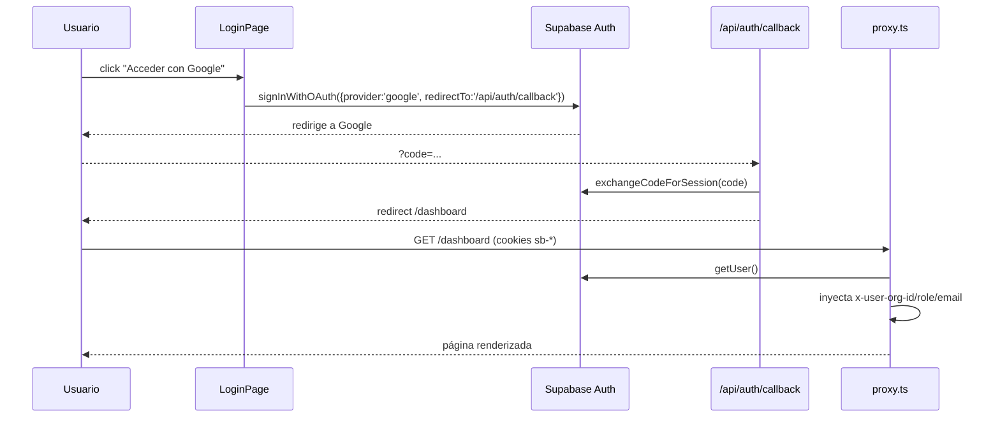
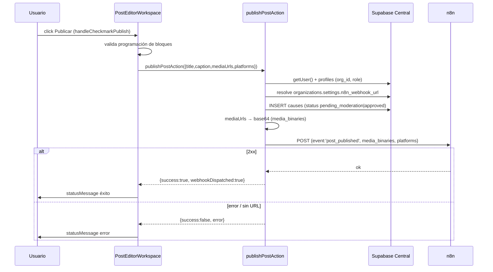
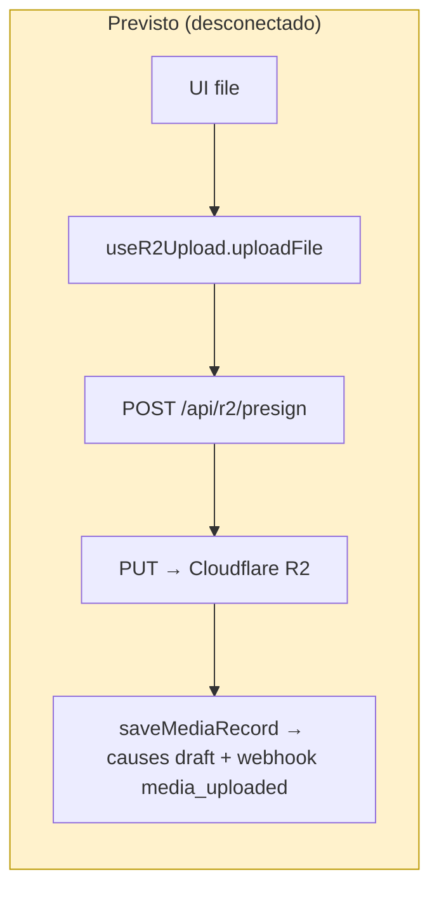
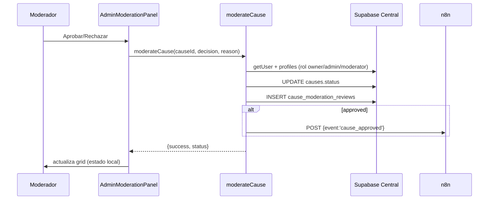
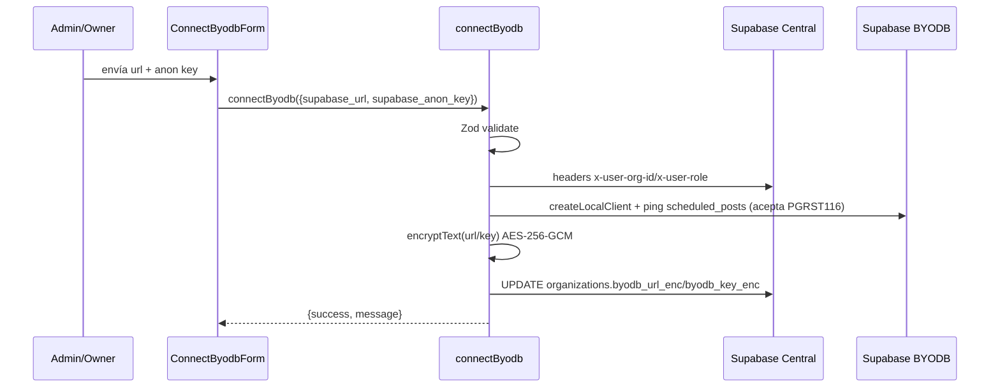

# Arquitectura del Proyecto

> **Documento generado por auditoría técnica automatizada — modo solo lectura.**
> Este documento es la **fuente de verdad** del repositorio y distingue en todo momento entre
> `VERIFICADO`, `INFERIDO`, `NO ENCONTRADO` y `PENDIENTE DE VALIDACIÓN`.

---

## Metadatos de auditoría

| Campo | Valor |
|---|---|
| Fecha de auditoría | 2026-08-18 |
| Rama analizada | `arena/01a011d6-hun-v1-1-antigravity` |
| Commit analizado | `8a361b5921dd038b61b0ffd72cb78296285dfa78` — *Merge pull request #27 from BLK3Devilleo/don-Emilio-frontend* |
| Autor del commit | BLK3DEVILLEO `<devimeo@gmail.com>` (2026-08-17 20:58 +0200) |
| Remoto | `origin = https://github.com/BLK3Devilleo/HUN-V1.1-antigravity.git` |
| Profundidad del clone | **Shallow (depth=1)** — `git rev-parse --is-shallow-repository` → `true`; solo 1 commit visible. `INFERIDO`: el historial real es mayor pero no está disponible localmente. |
| Alcance | Análisis estático de la totalidad del repositorio (62 archivos rastreados + infraestructura), sin modificar código. |
| Gestores detectados | npm (`package.json` + `package-lock.json`). No hay Python (`requirements.txt`/`pyproject.toml`/`poetry.lock`/`uv.lock`) — `NO ENCONTRADO`. |
| Instrucciones para agentes | `AGENTS.md`, `CLAUDE.md` (= `@AGENTS.md`), `docs/*`, `Homework.md`. No hay `CONTRIBUTING.md`, `.agents/`, ni `.github/` — `NO ENCONTRADO`. |
| Verificaciones ejecutadas | `npm ci`, `npx eslint .`, `npx tsc --noEmit`, `npm run build`, `npm audit` (detalle en §Pruebas y calidad y Anexo E). |
| Limitaciones | (1) El build no completa por falta de salida de red a `fonts.googleapis.com` (next/font) — limitación del sandbox, no error de código. (2) No hay credenciales ni entorno en vivo, por lo que Supabase/R2/n8n no se validaron en ejecución. (3) Clone shallow limita el historial. |

### Nombre real del proyecto

> **`VERIFICADO`** — El encargo de auditoría original menciona un sistema llamado "Filo Studio / OpenMontage".
> **Ese nombre no aparece en ningún punto del repositorio.** El producto real es **"NUH"**:
> - `package.json` → `"name": "hun-oficial-v1"`.
> - `app/layout.tsx` → título `"NUH — Central de Publicación"`, descripción *"Plataforma SaaS Multi-tenant para publicación automatizada en redes sociales."*.
> - Marca visible: `login`, `dashboard` ("NUH"), "Build For Venezuela".
>
> `NO ENCONTRADO`: toda referencia a "Filo Studio", "OpenMontage", "backlot/", "web/src/", "tools/", "tests/" o Python/FastAPI.

---

## Resumen ejecutivo

**Propósito del sistema (`VERIFICADO`):** NUH es una aplicación **web SaaS multi-tenant** que permite a organizaciones (causas/ONGs bajo "Build 4 Venezuela") autenticarse, componer publicaciones multi-variación para redes sociales, subir multimedia, moderar contenido y disparar la publicación automática a través de un orquestador externo (**n8n**).

**Arquitectura resumida:** una única aplicación **Next.js 16 (App Router, `output: 'standalone'`)** actúa a la vez de frontend y de backend (Server Actions + API Routes + `proxy.ts` como capa de red/autenticación). La persistencia se reparte en **Supabase Central** (tenant registry, usuarios, causas, moderación) y **Supabase BYODB** (base privada de cada organización: posts programados, tokens sociales, media, cola de publicación). Los archivos multimedia viven en **Cloudflare R2** con subida directa vía URL pre-firmada. La publicación final es delegada a **n8n** vía webhooks.

**Componentes críticos:**
1. `proxy.ts` — guardián de autenticación/autorización e inyección de cabeceras `x-user-*`.
2. `app/actions/*` — toda la lógica de negocio (publicar, moderar, conectar BYODB, configurar webhook).
3. `app/api/r2/presign` — firma de subidas a R2.
4. `lib/crypto.ts`, `lib/r2.ts`, `lib/supabase.ts` — criptografía, almacenamiento y clientes de datos.
5. `supabase/migrations/*.sql` — contratos de datos + RLS.
6. `components/dashboard/PostEditorWorkspace.tsx` (1954 líneas) — el componente más grande y de mayor fan-in/fan-out.

**Riesgos principales:** (detalle en §Seguridad y §Deuda técnica)
- P0: bypass de autenticación en `localhost` y fallback a rol `owner` en `proxy.ts`.
- P0: recursión en política RLS `profile_org_admin_select`.
- P0/P1: autorización basada en cabeceras `x-user-*` y en `orgId` provisto por el cliente, sin revalidación estricta.
- P1: flujo de subida de media (presign→R2→Supabase→n8n) escrito pero **no cableado** a la UI; el dashboard usa datos/mocks locales.
- P2: 4 vulnerabilidades `high` transitivas (postcss/sharp vía next), lint en rojo (19 errores), cero tests.

**Estado de salud general:** 🟡 **MVP en desarrollo.** El tipo compila (`tsc` limpio) y la UI está pulida, pero hay código backend desconectado, autorización frágil, lint rojo y ninguna cobertura de tests.

---

## Estado de verificación

| Categoría | Elementos |
|---|---|
| **VERIFICADO** | Estructura de 62 archivos; contenido de todos los `.ts/.tsx/.sql/.json/.yml/.md`; `package.json`/lock; `proxy.ts`; 2 API routes; 8 server actions; 3 módulos `lib/`; 1 hook; 10 componentes; 7 páginas; 2 migraciones; Dockerfile/compose; result. de `eslint`, `tsc`, `build`, `npm audit`. |
| **INFERIDO** | Historial real de git mayor que 1 commit (clone shallow). El rol de `@antigravity-agent-manager` (mencionado en el prompt) no se refleja en el código; se asume herramienta externa de orquestación. El motor `postcss`/`sharp` son dependencias **transitivas** de `next`. |
| **PENDIENTE DE VALIDACIÓN** | Ejecución real contra Supabase Central/BYODB, R2 y n8n (requiere credenciales); comportamiento en navegador (hydration, animaciones framer-motion); despliegue Dokploy/Docker; build completo con red a Google Fonts; recursión RLS en un Postgres real. |
| **NO ENCONTRADO** | Backend Python/FastAPI (`backlot/`), `web/src/`, `tools/`, `tests/`, SSE/WebSockets, workers/cron propios, CI/CD (`.github/`), `.env*` commitado, `lib/types.ts`, `middleware.ts`, `instrumentation.ts`, secretos en el repo. |

---

## Estructura del repositorio

`VERIFICADO` (árbol lógico; 62 archivos excluyendo `.git/`, `node_modules/`, `.next/`):

```
.
├── AGENTS.md, CLAUDE.md, README.md, Homework.md      # instrucciones / roadmap / invariantes
├── Dockerfile, docker-compose.yml, .dockerignore     # contenedorización
├── .gitignore, eslint.config.mjs, next.config.ts,
│   postcss.config.mjs, tsconfig.json                 # build/lint/config
├── package.json, package-lock.json                   # manifiesto npm
├── inventario_recursos_dependencias.csv              # inventario (84 filas)
├── proxy.ts                                          # ⭐ capa de red / auth (Next 16)
├── UI/BKND.md                                        # spec backend (programación/cola)
├── app/  (App Router)
│   ├── layout.tsx, page.tsx, globals.css, favicon.ico
│   ├── (auth)/login/page.tsx
│   ├── (dashboard)/dashboard/{page,admin,feed,gallery,profile,settings}/…
│   │       └── admin/ModerationPanel.tsx, settings/WebhookSettingsForm.tsx
│   ├── actions/{byodb,dashboard,media,moderation,post,settings}.ts
│   └── api/{auth/callback,r2/presign}/route.ts
├── components/{ConnectByodbForm.tsx, dashboard/*.tsx}  # 10 componentes
├── hooks/useR2Upload.ts
├── lib/{crypto,r2,supabase}.ts
├── public/*.svg                                        # defaults create-next-app
├── supabase/migrations/{001_schema_central,002_schema_local_byodb}.sql
└── docs/{Auditoria-Micro-Detalles-V2,PROTOCOLO_FRONTEND_BACKEND,BITACORA_IA_EMILIO}.md
```

### Clasificación de directorios (criticidad / estado)

| Ruta | Propósito | Tecnología | Criticidad | Estado |
|---|---|---|---|---|
| `proxy.ts` | Auth/autorización + headers de contexto | Next 16 edge/network | 🔴 CRÍTICO | activo |
| `app/actions/` | Lógica de negocio (server actions) | TS `'use server'` | 🔴 CRÍTICO | activo (2 sin uso) |
| `app/api/` | Endpoints HTTP | Route handlers | 🔴 CRÍTICO | activo |
| `lib/` | Cripto, R2, clientes Supabase | TS | 🔴 CRÍTICO | activo |
| `supabase/migrations/` | Esquema + RLS | SQL/Postgres | 🔴 CRÍTICO | activo |
| `components/dashboard/` | UI "Don Emilio" | React 19 + framer-motion | 🟡 ALTO | activo (zona congelada por invariante) |
| `app/(dashboard)/` | Páginas/rutas | Next App Router | 🟡 ALTO | activo |
| `app/(auth)/login/` | Login OAuth | React | 🟡 ALTO | activo |
| `hooks/` | Hook de subida | TS | 🟢 MEDIO | **sin referencias** |
| `docs/`, `UI/`, `inventario_*.csv` | Documentación/specs | Markdown/CSV | 🟢 BAJO | documentación |
| `public/` | Assets estáticos | SVG | 🟢 BAJO | defaults sin uso evidente |

### Archivos raíz relevantes

| Archivo | Función | Consumidor | Riesgo si se modifica |
|---|---|---|---|
| `package.json` | Manifiesto (scripts `dev/build/start/lint`) | npm | Alto — rompe build/instalación |
| `package-lock.json` | Versiones fijadas | npm ci | Alto — deriva de dependencias |
| `next.config.ts` | `output: 'standalone'` | Next | Alto — afecta despliegue Docker |
| `tsconfig.json` | TypeScript strict + `@/*` → `./*` | tsc/editor | Medio — alias y reglas |
| `eslint.config.mjs` | Reglas next/core-web-vitals + typescript | eslint | Medio |
| `postcss.config.mjs` | Tailwind 4 vía `@tailwindcss/postcss` | build | Medio |
| `Dockerfile` | Build multi-stage standalone | Docker/Dokploy | Alto |
| `docker-compose.yml` | Servicio `hun-frontend` (:3357) | Docker Compose | Alto |
| `proxy.ts` | Enrutamiento + auth | Next runtime | 🔴 Crítico |
| `AGENTS.md` / `CLAUDE.md` | Reglas para agentes IA | agentes/IA | Bajo (documental) |

---

## Tecnologías y dependencias

### Runtime y frameworks (`VERIFICADO`, `package.json`)

| Categoría | Detalle |
|---|---|
| Runtime | Node.js (`node:22-alpine` en Docker; sin campo `engines` en package.json). Sandbox: Node v22.22.3. |
| Framework | **next 16.2.10** (exacto), React **19.2.4**, react-dom 19.2.4 |
| UI/animación | framer-motion ^12.42.2, lucide-react ^1.25.0 |
| Datos | @supabase/supabase-js ^2.110.7, @supabase/ssr ^0.12.3 |
| Storage | @aws-sdk/client-s3 ^3.1090.0, @aws-sdk/s3-request-presigner ^3.1090.0 |
| Formularios | react-hook-form ^7.81.0, @hookform/resolvers ^5.4.0, zod ^4.4.3 |
| Dev | tailwindcss ^4, @tailwindcss/postcss ^4, typescript ^5, @types/*, eslint ^9, eslint-config-next 16.2.10 |

### Dependencias críticas y de riesgo

| Dependencia | Tipo | Superficie de riesgo |
|---|---|---|
| `next` | producción | Framework fullstack; expone rutas/red; vulnerabilidades transitivas postcss+sharp |
| `@supabase/supabase-js` / `@supabase/ssr` | producción | Acceso a datos y auth |
| `@aws-sdk/client-s3` + presigner | producción | Firma de subidas a storage |
| `zod` | producción | Validación de inputs |
| `crypto` (node built-in) | lib | Cifrado AES-256-GCM de credenciales BYODB |

### Dependencias aparentemente no usadas (`VERIFICADO` — no referenciadas en código)

- `@hookform/resolvers` y `react-hook-form`: usados solo en `ConnectByodbForm.tsx` (form BYODB). **Sí usados**, pero limitados a un único formulario.
- No se detectaron paquetes instalados sin ningún import (todas las dependencias directas tienen al menos un consumidor; ver Anexo C).

### Vulnerabilidades (`npm audit --omit=dev`, `VERIFICADO`)

```
4 high severity vulnerabilities (transitivas vía next):
- postcss <=8.5.22 (XSS stringify, path traversal .map disclosure) → node_modules/next/node_modules/postcss
- sharp <0.35.0 (libvips CVE-2026-* ) → node_modules/sharp
Fix sugerido por npm: npm audit fix --force → instalaría next@16.3.1 (fuera del rango fijado 16.2.10)
```
`INFERIDO`: son dependencias **transitivas** de `next`; no hay uso directo de postcss/sharp en el código de la app. Riesgo real depende del entorno de producción. No se declararon vulnerabilidades propias del código de negocio.

---

## Entrypoints y ejecución local

| Entrypoint | Archivo/comando | Runtime | Puerto | Env requeridas | Servicios que depende | Inicializa |
|---|---|---|---|---|---|---|
| Dev server | `npm run dev` → `next dev` | Node | 3000 (default) | Supabase/R2 (solo si se usan features) | Supabase Central (auth) | HMR + App Router |
| Build | `npm run build` → `next build` | Node | — | `NEXT_PUBLIC_SUPABASE_*`, `NEXT_PUBLIC_APP_URL` (build args en Docker) | red a Google Fonts (next/font) | compila standalone |
| Prod server | `npm run start` → `next start` | Node | `PORT` (3357 en Docker) | todas (Anexo D) | Supabase, R2, n8n | sirve `.next` |
| Docker | `docker-compose up` / `Dockerfile` | node:22-alpine | **3357** | build args + env (Anexo D) | Supabase, R2, n8n | `CMD ["node","server.js"]` |
| Lint | `npm run lint` | Node | — | — | — | eslint |

**Puntos de entrada de datos/ciclo de vida:**
- No hay CLI, workers, cron jobs, consumers de colas ni funciones serverless propias — `NO ENCONTRADO`.
- El único "proceso asíncrono" es el **webhook saliente fire-and-forget a n8n** (dentro de server actions).
- Migraciones: SQL manuales (`supabase/migrations/*.sql`), sin runner de migraciones automático.
- Limpieza: procesos Next/Docker estándar; no hay lógica de shutdown custom.

---

## Arquitectura de alto nivel

```mermaid
flowchart LR
  subgraph Client["Cliente (navegador)"]
    UI["React 19 / Next.js 16 App Router<br/>Dashboard 'Don Emilio'"]
  end

  subgraph Next["Aplicación Next.js (standalone, :3357)"]
    PX["proxy.ts<br/>auth + cabeceras x-user-*"]
    SA["Server Actions<br/>post / media / moderation / byodb / settings / dashboard"]
    API["API Routes<br/>/api/auth/callback<br/>/api/r2/presign"]
    LIB["lib/<br/>crypto · r2 · supabase"]
  end

  SC["Supabase Central<br/>organizations · profiles · causes · cause_moderation_reviews"]
  SB["Supabase BYODB (por tenant)<br/>scheduled_posts · social_tokens · media_files · publish_queue · webhook_events"]
  R2["Cloudflare R2<br/>(presigned upload ≤500MB)"]
  N8N["n8n webhook<br/>(publicación en redes)"]
  GA["Google OAuth<br/>(Supabase Auth)"]

  UI -->|peticiones| PX
  PX --> SA
  PX --> API
  SA --> LIB
  API --> LIB
  LIB -->|SELECT/INSERT/UPDATE| SC
  LIB -->|queries locales (x-org-id)| SB
  LIB -->|presigned URL| R2
  SA -->|POST webhook| N8N
  UI -->|PUT directo| R2
  UI -->|signInWithOAuth| GA
  GA -->|callback| API
```

> **Qué representa:** el flujo de peticiones desde el navegador, pasando por el proxy (auth), hacia server actions/rutas, y de ahí a los 4 servicios externos.
> **Limitaciones:** no muestra el detalle de cookies de sesión, ni el flujo interno de cifrado de credenciales BYODB, ni que `getDashboardData`/`saveMediaRecord` están desconectados.

---

## Backend y servicios

No hay backend separado (Python/FastAPI `NO ENCONTRADO`). El backend es **Next.js**:

### `proxy.ts` (capa de red / guardián)

- `config.matcher` excluye `_next/static`, `_next/image`, `favicon.ico`, assets estáticos.
- Intercepta: `pathname === '/'` o `/dashboard/*` (dashboard) y `/api/*` salvo `/api/auth/*`.
- Flujo (`VERIFICADO`):
  1. `createServerClient` (`@supabase/ssr`) con adaptador de cookies.
  2. `supabase.auth.getUser()`.
  3. Sin usuario → **localhost**: inyecta `org-1`/`admin` y deja pasar; producción: redirect `/login`.
  4. Con usuario → con `SUPABASE_CENTRAL_SERVICE_ROLE_KEY` consulta `profiles(org_id, role)` e inyecta `x-user-org-id`, `x-user-role`, `x-user-email`.
  5. Fallbacks: sin service key o fallo de `profiles` → inyecta `org-1`/rol `owner`.
- `getSafeRedirectUrl()`: construye URLs seguras (localhost vs `NEXT_PUBLIC_APP_URL` vs `x-forwarded-host`; detecta host interno Docker).

### Server Actions (`app/actions/`, `'use server'`)

| Archivo | Símbolos exportados | Estado |
|---|---|---|
| `byodb.ts` | `ConnectByodbSchema`, `ConnectByodbInput`, `ActionResult`, `connectByodb()`, `getByodbStatus()` | usado (settings) |
| `dashboard.ts` | `DashboardPost/Org/DataResult`, `getDashboardData()` | **sin uso** |
| `media.ts` | `saveMediaRecord()` | **sin uso** |
| `moderation.ts` | `moderateCause()` | usado (admin) |
| `post.ts` | `PublishPostPayload`, `publishPostAction()` | usado (editor, import dinámico) |
| `settings.ts` | `saveN8nWebhook()`, `getN8nWebhook()` | usado (settings) |

Ver flujo detallado en §Flujos funcionales y Anexo B.

### API Routes

| Ruta | Método | Controlador | Descripción |
|---|---|---|---|
| `/api/auth/callback` | GET | `GET()` en `route.ts` | `exchangeCodeForSession(code)` → redirect |
| `/api/r2/presign` | POST | `POST()` → `generatePresignedUploadUrl` | presigned URL (auth por header `x-user-org-id`) |

### lib/ (conectores)

| Archivo | Exporta | Acceso externo |
|---|---|---|
| `lib/crypto.ts` | `encryptText`, `decryptText` (AES-256-GCM) | `process.env.BYODB_ENCRYPTION_KEY \|\| ENCRYPTION_SECRET` |
| `lib/r2.ts` | `generatePresignedUploadUrl`, `PresignedUrlResult` | R2 (S3 API), `R2_*` env |
| `lib/supabase.ts` | `createBrowserClient`, `createLocalClient` | Supabase Central + BYODB |

---

## Frontend e interfaz

### Sistema de rutas (`VERIFICADO`)

| Ruta | Tipo de render | Fuente de datos |
|---|---|---|
| `/` | Server | `redirect('/dashboard')` |
| `/login` | Client | Supabase Auth (OAuth Google) |
| `/dashboard` | Client (672 l) | **estado local / mocks** |
| `/dashboard/feed` | Server (`revalidate=60`) | `causes` (status approved) + join `organizations` |
| `/dashboard/gallery` | Server | `causes` de la org con `media_url` |
| `/dashboard/profile` | Server | cabeceras `x-user-*` |
| `/dashboard/settings` | Server | `getByodbStatus()` + forms |
| `/dashboard/admin` | Server | rol-gate por header + `causes` pendientes |

No hay `layout.tsx` por grupo de rutas (solo el root layout) — `VERIFICADO`.

### Componentes (`components/dashboard/`)

| Componente | Props principales | Estado local | APIs/efectos |
|---|---|---|---|
| `PostEditorWorkspace` (1954 l) | `initialMedia, currentPostTitle, activeProjectId, projectDraft, onContentStarted, onTitleChange, onSaveProjectState` | 15+ estados (bloques, título, publicación, calendario) | `publishPostAction` (dynamic import) |
| `ConversationsSidebar` (286 l) | `onBackToDashboard, selectedOrg, onSelectOrg, onSelectProject, onDeleteProject, onNewProjectClick, projectsList, activeProjectId` | org actual, dropdown, fades | — |
| `SocialSidebar` (273 l) | `isTransitioning, onOpenProfile` | `expanded`, `isConfigOpen` | `Link` a /settings,/gallery,/admin,/feed |
| `GalleryWorkspace` (228 l) | `initialItems` | `selectedItem`, `filterType` | — |
| `FeedGrid` (137 l) | `causes` | — | `next/image`, `Link` |
| `UploadQueueWidget` (152 l) | `description, isUploading, hasError, queueCount…` | `isHovered`, `showErrorState` | — |
| `ContentStack` (114 l) | — | `isHovered` | — |
| `FolderCard` (56 l) | `title, children, onClick` | — | — |
| `StorageBar` (41 l) | `usedGB, totalGB` | — | — |
| `ConnectByodbForm` (224 l) | `isConnected, connectedDomain` | form RHF + zod | `connectByodb` |
| `WebhookSettingsForm` (103 l) | — | `webhookUrl, loading, message` | `saveN8nWebhook`/`getN8nWebhook` |
| `ModerationPanel` (226 l) | `initialCauses` | `causes, filter, rejectionReason` | `moderateCause` |

### Hooks

| Hook | Archivo | Retorna | Consumidor |
|---|---|---|---|
| `useR2Upload` | `hooks/useR2Upload.ts` | `{ uploadFile, isUploading, progress }` | ❌ **nadie** |

### Riesgos de render/frontend (`VERIFICADO` por lint)

- `react-hooks/set-state-in-effect` (login y PostEditorWorkspace): `setState` dentro de efectos → cascada de renders.
- `react-hooks/purity` (`Date.now()` durante render en PostEditorWorkspace:752) → render no determinista.
- `@next/next/no-img-element` en PostEditorWorkspace y UploadQueueWidget (LCP/bandwidth).
- Sin `next/image` en varios `` con URLs dinámicas.
- Estado de programación del editor calculado en UI pero **no enviado** al publicar (ver §Flujos).

---

## Modelos de datos y persistencia

### Persistencia detectada

| Recurso | Tecnología | Config | Propietario |
|---|---|---|---|
| Supabase Central | Postgres + Auth | `NEXT_PUBLIC_SUPABASE_CENTRAL_URL`, anon + service role keys | Plataforma NUH |
| Supabase BYODB | Postgres (instancia cliente) | credenciales cifradas en `organizations.byodb_*_enc` | Organización |
| Cloudflare R2 | Object storage S3 | `R2_*` env | Plataforma (por org vía path) |
| Cookies de sesión | `@supabase/ssr` | `sb-*` cookies | Supabase Auth |
| Memoria local | `URL.createObjectURL`, `useState` | dashboard | efímera (no persiste) |

`NO ENCONTRADO`: localStorage/sessionStorage/IndexedDB, caché propia, Redis.

### Esquema Central (`001_schema_central.sql`, 285 l) — `VERIFICADO`

- **organizations**: `id(UUID PK), name, slug(UNIQUE), plan(enum free/starter/pro/enterprise), byodb_url_enc, byodb_key_enc, is_active, settings(JSONB), created_at, updated_at`.
- **profiles**: `id(UUID PK→auth.users), org_id(FK), email(UNIQUE), full_name, avatar_url, role(enum owner/admin/member/moderator), is_active, timestamps`.
- **causes**: `id, org_id(FK), creator_id(FK), title, description, category(enum educacion/salud/ambiente/construccion/emprendimiento/otro), cta_text, cta_url, media_url, status(enum draft/pending_moderation/approved/rejected/archived), rejection_reason, moderation_score, hashtags(TEXT[]), total_shares, last_shown_at, timestamps`.
- **cause_moderation_reviews**: `id, cause_id(FK), moderator_id(FK→profiles), decision(enum approved/rejected/needs_info), checklist(JSONB), notes, ai_analysis(JSONB), created_at`.
- Funciones: `set_updated_at`, `handle_new_auth_user`, `get_causes_feed`, `on_cause_shared`; vista `moderation_queue`.
- **RLS** habilitada en las 4 tablas (ver §Seguridad).

### Esquema BYODB (`002_schema_local_byodb.sql`, 265 l) — `VERIFICADO`

- **scheduled_posts**: `id, org_id(TEXT), created_by, title, caption, media_urls(TEXT[]), media_types(TEXT[]), platforms(TEXT[]), status(enum draft/scheduled/processing/published/failed), scheduled_at, published_at, source_cause_id, origin(enum own/cause_shared), n8n_webhook_triggered, error_log, timestamps`.
- **social_tokens**: `id, org_id, platform(enum instagram/facebook/linkedin/x/tiktok), platform_account_id, platform_username, access_token_enc, refresh_token_enc, token_expires_at, status(enum connected/expired/revoked/error), meta(JSONB), timestamps`.
- **media_files**: `id, post_id(FK), org_id, storage_url, storage_path, file_type(enum image/video), file_size, mime_type, status(enum pending/uploading/ready/published/cleaned), upload_progress(0-100), timestamps`.
- **publish_queue**: `id, org_id, post_id(FK), platform, social_token_id(FK), caption, media_urls(TEXT[]), scheduled_at, status(enum pending/ready/publishing/published/failed/cancelled), retry_count, max_retries(default 5), idempotency_key(UNIQUE), n8n_execution_id, published_url, error_message, timestamps`.
- **webhook_events**: `id, org_id, source(enum n8n/app/supabase), event_type, payload(JSONB), status, created_at`.
- Trigger `on_post_scheduled` (crea filas en `publish_queue` por plataforma); vista `n8n_pending_queue`; RLS por org vía `request.headers->>'x-org-id'`.

### Tipos TS (`VERIFICADO` — ver Anexo C completo)

- `ContentVariationBlock`, `ProjectDraft`, `SelectedMedia`, `PostEditorWorkspaceProps` (PostEditorWorkspace).
- `ProjectItem`, `ConversationsSidebarProps` (ConversationsSidebar).
- `FeedCause`, `MediaItem`, `FolderCardProps`, `StorageBarProps`, `UploadQueueWidgetProps`.
- `PresignedUrlResult` (lib/r2).
- `PublishPostPayload`, `ConnectByodbInput`, `ActionResult`, `DashboardPost/Org/DataResult`.

---

## API y contratos

### Endpoints HTTP

| ID | Método | Ruta | Controlador | Auth | Entrada | Validación | Salida | Persistencia | Consumidores | Estado |
|---|---|---|---|---|---|---|---|---|---|---|
| E-01 | GET | `/api/auth/callback` | `GET()` route | ninguna (callback) | query `code`, `next?` | — | redirect | cookies sesión (Supabase) | Supabase OAuth | usado |
| E-02 | POST | `/api/r2/presign` | `POST()` route | header `x-user-org-id` | `{fileName, mimeType, fileSize}` | Zod `PresignSchema` | `{uploadUrl, publicUrl, r2Path}` | — (firma) | `useR2Upload` (❌ sin uso) | **posiblemente sin uso** |

### Server Actions (operaciones RPC)

| ID | Acción | Auth | Entrada | Salida | Consumidor | Estado |
|---|---|---|---|---|---|---|
| A-01 | `connectByodb` | rol owner/admin (header) | `{supabase_url, supabase_anon_key}` | `ActionResult` | `ConnectByodbForm` | usado |
| A-02 | `getByodbStatus` | header `x-user-org-id` | — | `{connected, url}` | `settings/page.tsx` | usado |
| A-03 | `moderateCause` | rol owner/admin/moderator | `(causeId, decision, reason?)` | `{success, status\|error}` | `ModerationPanel` | usado |
| A-04 | `publishPostAction` | usuario + perfil | `PublishPostPayload` | `{success, causeId?, webhookDispatched?, message\|error}` | `PostEditorWorkspace` | usado |
| A-05 | `saveN8nWebhook` | owner/admin | `webhookUrl` | `{success}\|{success:false,error}` | `WebhookSettingsForm` | usado |
| A-06 | `getN8nWebhook` | header org | — | `{url}` | `WebhookSettingsForm` | usado |
| A-07 | `getDashboardData` | header org | — | `DashboardDataResult` | ❌ nadie | **sin uso** |
| A-08 | `saveMediaRecord` | usuario + perfil | `(mediaUrl, fileName)` | `{success, causeId?}` | ❌ nadie | **sin uso** |

### Webhooks salientes (→ n8n)

| ID | Evento | Productor | Payload | Consumidor |
|---|---|---|---|---|
| W-01 | `media_uploaded` | `saveMediaRecord` | `{event, cause_id, media_url, file_name, org_id}` | n8n (❌ productor sin uso) |
| W-02 | `post_published` | `publishPostAction` | `{event, cause_id, title, caption, media_urls, media_binaries[], platforms, org_id, timestamp}` | n8n |
| W-03 | `cause_approved` | `moderateCause` | `{event, cause_id, media_url, title, org_id}` | n8n |

`NO ENCONTRADO`: SSE, WebSocket, GraphQL, polling explícito, webhooks entrantes (no hay `/api/n8n/callback`).

### Matriz de consistencia (resumen)

| Divergencia | Evidencia | Impacto |
|---|---|---|
| Endpoints/acciones **sin consumidor** | `useR2Upload`, `saveMediaRecord`, `getDashboardData` (grep sin referencias) | código muerto / flujo de subida roto |
| UI con **mocks** | `dashboard/page.tsx` `INITIAL_PROJECTS` + métricas hardcodeadas vs datos reales en `causes` | datos inconsistentes |
| Payload de programación **no enviado** | `UI/BKND.md` define `blocks[]/scheduledTimestamp`; `publishPostAction` solo recibe `caption/mediaUrls/platforms` | programación no funcional |
| Tipos **dispersos**, sin `lib/types.ts` | protocolo exige carpeta neutral; tipos en cada componente | duplicación/divergencia |
| Enums DB vs UI | `status` de `causes` en SQL vs `item.status: string` (GalleryWorkspace) sin enum tipado | pérdida de seguridad de tipos |

---

## Estado y comunicación entre módulos

### Estado (`VERIFICADO`)

**No hay estado global** (sin Context/Redux/Zustand/React Query). Todo es `useState` local + prop drilling.

| Estado | Definido en | Tipo | Consumido por | Modificado por | ¿Persistido? |
|---|---|---|---|---|---|
| `selectedFiles` | `dashboard/page.tsx` | `SelectedMedia[]` | page, `PostEditorWorkspace` (via `initialMedia`) | `handleFileSelect/RemoveFile/CancelSelection` | ❌ (objectURL efímero) |
| `isEditorActive` | `dashboard/page.tsx` | boolean | page, `SocialSidebar` | `handleConfirm/BackToDashboard/NewProjectClick` | ❌ |
| `selectedOrg` | `dashboard/page.tsx` | string | `ConversationsSidebar`, dropdown | `setSelectedOrg` | ❌ |
| `projectsList` | `dashboard/page.tsx` | `ProjectDraft[]` | `ConversationsSidebar`, `PostEditorWorkspace` | `handleSave/Delete/ContentStarted/TitleChange` | ❌ |
| `activeProjectId` | `dashboard/page.tsx` | `string\|null` | ambos hijos | varios | ❌ |
| `variationBlocks`, `activeBlockId`, `postTitle` | `PostEditorWorkspace` | — | editor (render) | `buildInitialBlocks` + effects | ❌ |
| `isPublishing`, `statusMessage/Type` | `PostEditorWorkspace` | — | editor | `proceedWithPublish` | ❌ |
| `scheduledDate/Time`, `sameDayForProject`, `calendarStep` | `PostEditorWorkspace` | — | calendario | handlers | ❌ |
| `causes`, `filter`, `rejectionReason` | `ModerationPanel` | — | grid | `handleModerate`, filtros | ❌ |

**Sincronización padre↔hijo crítica:** `PostEditorWorkspace` tiene 2 `useEffect` que escriben hacia arriba vía `onSaveProjectState` (líneas 431-478 y 482-502), con `lastSavedStateRef` para evitar bucles. `INFERIDO`: riesgo de re-renders en cascada (confirmado por lint `set-state-in-effect`).

### Comunicación / acoplamiento

- **Prop drilling** intenso entre `page.tsx` y sus hijos (ver tabla props §Frontend).
- **Duplicación**: `isUuid()` y `getAdminClient()` repetidos en `post.ts` y `settings.ts`.
- **Mocks duplicados**: `MOCK_ORGANIZATIONS` (dashboard.ts) y `DEFAULT_MOCK_PROJECTS` (ConversationsSidebar).
- **Imports dinámicos**: `publishPostAction` se importa con `await import('@/app/actions/post')` (code-splitting).
- **Sin dependencias circulares** detectadas entre módulos.
- **`any`**: presente en `ConversationsSidebarProps.onSelectProject/onSelectConversation`, `catch (error: any)` en varias acciones y `feed/page.tsx` (`c: any`), `post.ts` (`webhookErr: any`), etc. (12 errores lint `no-explicit-any`).

---

## Integraciones externas

| Integración | Contrato | Ubicación | Estado |
|---|---|---|---|
| Supabase Auth (Google OAuth) | `signInWithOAuth`, `exchangeCodeForSession`, `getUser` | `login`, `api/auth/callback`, `proxy` | VERIFICADO (código) / PENDIENTE (runtime) |
| Supabase Central (Postgres) | tablas `organizations/profiles/causes/cause_moderation_reviews` | migración 001 + `lib/supabase` + actions | VERIFICADO |
| Supabase BYODB | tablas `scheduled_posts/social_tokens/media_files/publish_queue/webhook_events` + header `x-org-id` | migración 002 + `createLocalClient` | VERIFICADO (esquema) / PENDIENTE (uso real: solo `connectByodb` hace ping) |
| Cloudflare R2 | presigned PUT, MIME whitelist, ≤500MB, path `orgs/{orgId}/{ts}_{name}` | `lib/r2.ts` + `/api/r2/presign` | VERIFICADO (código) / sin consumidor en UI |
| n8n | webhooks `media_uploaded/post_published/cause_approved` | `post.ts`, `media.ts`, `moderation.ts` | VERIFICADO (solo `post_published` y `cause_approved` se disparan hoy) |
| Google Fonts (next/font) | build-time fetch de Inter/Anton/Barlow | `app/layout.tsx` | VERIFICADO (causa del fallo de build en sandbox) |
| Telegraf (cdnfonts) | CSS `@import` | `globals.css` | VERIFICADO (runtime del navegador) |

---

## Infraestructura, configuración y despliegue

### Docker (`VERIFICADO`)

- **Dockerfile** multi-stage (`base/deps/builder/runner`), `node:22-alpine`, `output:'standalone'`, usuario no-root `nextjs` (uid 1001), `EXPOSE 3357`, `ENV PORT=3357`, `ENV HOSTNAME="0.0.0.0"`, `CMD ["node","server.js"]`.
- **docker-compose.yml**: servicio `hun-frontend` (container `hun-frontend-app`), build args + environment completos, `ports 3357:3357`, `restart: always`, logging `json-file` (10m × 3).
- **Build args**: `NEXT_PUBLIC_SUPABASE_CENTRAL_URL`, `NEXT_PUBLIC_SUPABASE_CENTRAL_ANON_KEY`, `NEXT_PUBLIC_APP_URL` (necesarios en build por `next/font`/envar).

### CI/CD, IaC, observabilidad

`NO ENCONTRADO`: `.github/`, GitHub Actions, Kubernetes, Terraform, Vercel/Netlify config. Despliegue `INFERIDO` a Dokploy (documentado en `BITACORA_IA_EMILIO.md`, que además exige `middleware.ts` por un bug de 502 — pero el repo usa `proxy.ts`).

`NO ENCONTRADO`: health checks, métricas, trazas, dashboards, alertas, correlation IDs. Única observabilidad: `console.log/error/warn` en acciones y proxy (logs de aplicación).

### Variables de entorno (Anexo D — nombres únicamente, sin valores)

Todas referenciadas en `docker-compose.yml`, `Dockerfile`, `proxy.ts`, `lib/*`, `app/actions/*`:
`NEXT_PUBLIC_SUPABASE_CENTRAL_URL`, `NEXT_PUBLIC_SUPABASE_CENTRAL_ANON_KEY`, `SUPABASE_CENTRAL_SERVICE_ROLE_KEY` (alias `SUPABASE_SERVICE_ROLE_KEY`), `NEXT_PUBLIC_APP_URL`, `R2_ACCOUNT_ID`, `R2_ACCESS_KEY_ID`, `R2_SECRET_ACCESS_KEY`, `R2_BUCKET_NAME`, `NEXT_PUBLIC_R2_PUBLIC_URL`, `BYODB_ENCRYPTION_KEY` (alias `ENCRYPTION_SECRET`), `N8N_WEBHOOK_URL`, `NODE_ENV`, `PORT`, `HOSTNAME`, `NEXT_TELEMETRY_DISABLED`.

`VERIFICADO`: **no hay `.env*` commiteado** (gitignored); no se exponen secretos en el repo.

---

## Seguridad

### Autenticación y autorización

- **Auth**: Supabase Auth (Google OAuth) + whitelist por tabla `profiles` (email ↔ org). Mensaje en login: "Acceso reservado para organizaciones autorizadas en Whitelist."
- **Autorización**: se propaga vía cabeceras `x-user-org-id`, `x-user-role`, `x-user-email` inyectadas por `proxy.ts`, y por `getUser()`/`profiles` en las acciones.
- **RLS**: habilitada en todas las tablas de ambas bases (políticas por org/rol).

### Hallazgos de seguridad (clasificación P0–P3)

| ID | Hallazgo | Evidencia | Prioridad |
|---|---|---|---|
| S-01 | **Bypass de auth en localhost**: sin usuario se inyecta `org-1`/`admin` y se deja pasar | `proxy.ts` L79-94 | **P0** |
| S-02 | **Escalada a rol `owner`**: si falta service key o falla `profiles`, inyecta `org-1`/`owner` | `proxy.ts` L103-113, L133-139 | **P0** |
| S-03 | **Recursión RLS** en `profile_org_admin_select` (subquery sobre `profiles`) | `001_schema_central.sql` | **P0** |
| S-04 | **Autorización por cabecera** `x-user-org-id` (sin firma) como fuente de verdad en `/api/r2/presign` y acciones | `route.ts` L13, `byodb.ts` L53 | **P1** |
| S-05 | **`orgId` provisto por el cliente** (`payload.orgId`) con fallback a "primera org de la BD" | `post.ts` L62, L93-100 | **P1** |
| S-06 | Subida de archivos con **whitelist MIME + límite 500MB** pero sin verificación de contenido binario ni antivirus | `lib/r2.ts` | **P2** |
| S-07 | `getSafeRedirectUrl` robusta, pero el callback OAuth redirige a `next` provisto por query sin validación de dominio más allá de origin | `api/auth/callback/route.ts` L33 | **P2** |
| S-08 | Cifrado de credenciales BYODB con **AES-256-GCM en Node** (clave en env), en vez de `pgcrypto` (el esquema SQL 002 lo documenta como `pgp_sym_decrypt`) | `lib/crypto.ts` vs `002_schema_local_byodb.sql` | **P2** |
| S-09 | `webhook_events.webhooks_service_only` policy `USING(false)` correcta; pero n8n necesita service_role (bypass RLS) — sin evidencia de cómo se entrega la key | `002` | **P3** |

`NO ENCONTRADO`: rate limiting explícito, CORS config (no hay `next.config` headers/CORS), CSRF tokens, sanitización XSS de captions antes del webhook, validación de path traversal en `r2Path` (sí sanitiza nombre de archivo).

---

## Activos, recursos y almacenamiento

- **`public/`**: solo SVGs por defecto de create-next-app (`file.svg, globe.svg, next.svg, vercel.svg, window.svg`). Sin assets de marca. `VERIFICADO`.
- **No hay** `assets/`, `uploads/`, `media/`, `storage/`, fixtures, seeds ni prompts — `NO ENCONTRADO`.
- **Multimedia**: vive en **Cloudflare R2** (path `orgs/{orgId}/{ts}_{sanitizedName}`), referenciado por `causes.media_url` y `scheduled_posts.media_urls`. No versionado en Git.
- **Datos semilla**: `INITIAL_PROJECTS` (dashboard) y `DEFAULT_MOCK_PROJECTS` (ConversationsSidebar) — datos **hardcodeados en producción**.
- **Documentación**: `docs/` (3 archivos), `UI/BKND.md`, `inventario_recursos_dependencias.csv` (84 filas de recursos/deps/tablas).

### Brechas entre capas

| Capa | Estado | Brecha |
|---|---|---|
| Disco (repo) | 0 assets de media | — |
| BBDD | `causes.media_url` + `media_files` (BYODB) | vacío hasta que el flujo de subida funcione |
| API | `POST /api/r2/presign` | sin consumidor |
| UI dashboard | mocks locales (`INITIAL_PROJECTS`, métricas 3500GB/252K/8/100) | **no refleja la BD** |
| UI gallery/feed/admin | sí consulta Supabase | coherente |

---

## Pruebas y calidad

### Verificaciones ejecutadas (resultados reales)

| Comando | Dir | Exit | Resultado |
|---|---|---|---|
| `npm ci --no-audit --no-fund` | raíz | **0** | 411 paquetes instalados |
| `npx tsc --noEmit` | raíz | **0** | ✅ Typecheck limpio |
| `npx eslint .` | raíz | **1** | ❌ 41 problemas (**19 errores, 22 warnings**) |
| `npm run build` | raíz | **1** | ❌ Falla en `next/font` (fetch Google Fonts bloqueado) — limitación de red, no error de código |
| `npm audit --omit=dev` | raíz | 1 (con hallazgos) | 4 vulnerabilidades high transitivas |
| tests | — | — | **No hay** (sin script `test`, sin archivos `*.test.*`/`*.spec.*`) |

### Errores de lint (`VERIFICADO`, 19 errores)

| Regla | Cantidad | Archivos destacados |
|---|---|---|
| `@typescript-eslint/no-explicit-any` | 12 | login, media, moderation, post, settings, callback, ConversationsSidebar, GalleryWorkspace, PostEditorWorkspace, useR2Upload |
| `react-hooks/set-state-in-effect` | 2 | login:18, PostEditorWorkspace:453 |
| `prefer-const` | 2 | actions/dashboard.ts:83, PostEditorWorkspace:631 |
| `react-hooks/purity` (Date.now) | 1 | PostEditorWorkspace:752 |
| `react/no-unescaped-entities` | 2 | api/auth/callback:99 |

Warnings (22): `@typescript-eslint/no-unused-vars` (6), `no-img-element` (3), `exhaustive-deps`, etc.

### Calidad de código adicional

- **Marcadores TODO/FIXME/HACK/XXX**: `NO ENCONTRADO` como estándar. Existen comentarios `✅ FIX W-5` (fix ya aplicado) en `ModerationPanel.tsx`.
- **Código muerto**: `useR2Upload`, `saveMediaRecord`, `getDashboardData` (0 referencias).
- **Componente monolítico**: `PostEditorWorkspace.tsx` = **1954 líneas** (alto riesgo de mantenimiento).
- **Funciones/helpers duplicados**: `isUuid`, `getAdminClient` (post.ts y settings.ts); boilerplate de cliente Supabase server repetido en todas las acciones.
- **Mocks en producción**: `INITIAL_PROJECTS`, `DEFAULT_MOCK_PROJECTS`, `MOCK_ORGANIZATIONS`, métricas hardcodeadas.
- **Sin paginación**: `gallery`/`admin`/`feed` (`limit 100`/`30` fijo en algunos).
- **Manejo de errores**: capturas amplias `catch (error: any)` con `console.error`; sin estrategia de retry en webhooks (fire-and-forget).

---

## Flujos funcionales principales

### Flujo: Autenticación (login)


- **Validación por código** ✅ / **por test** ❌ / **entorno** ⏳ pendiente.
- **Riesgo**: bypass en localhost (S-01); redirect `next` sin whitelist estricta (S-07).
- **Archivos críticos**: `app/(auth)/login/page.tsx`, `app/api/auth/callback/route.ts`, `proxy.ts`.

### Flujo: Publicación (editor → n8n)


- **Riesgo**: `orgId` del cliente (S-05); programación no enviada; sin retry del webhook.
- **Archivos críticos**: `PostEditorWorkspace.tsx` (357-410), `app/actions/post.ts`.

### Flujo: Subida de media (previsto vs. real)


- **Real (`VERIFICADO`)**: el dashboard usa `URL.createObjectURL` y no persiste. `useR2Upload`/`saveMediaRecord`/`/api/r2/presign` existen pero no están cableados.

### Flujo: Moderación



### Flujo: Conexión BYODB



---

## Grafo de impacto y guía de cambios

| Cambio en | Puede afectar a | Motivo | Riesgo | Verificaciones recomendadas |
|---|---|---|---|---|
| `proxy.ts` (auth) | todas las rutas `/dashboard`, `/api/*` | cabeceras `x-user-*` + redirects | 🔴 Crítico | probar login local + prod; no romper cookies `@supabase/ssr` |
| `organizations`/`profiles`/`causes` (schema Central) | login, dashboard, feed, gallery, admin, acciones | claves foráneas + RLS | 🔴 Alto | revisar migraciones + RLS (recursión S-03) |
| `causes.status` (enum) | moderación, feed, gallery, publish | filtros por estado | Alto | actualizar todos los consumidores de `status` |
| `publishPostAction` | publicación + n8n | contrato de payload | Alto | probar webhook n8n real + idempotencia |
| `lib/supabase.ts` (`createLocalClient`) | BYODB | header `x-org-id` para RLS local | Alto | probar RLS con org real |
| `lib/r2.ts` | subida de media | whitelist MIME + path | Medio | probar presign + PUT |
| `PostEditorWorkspace` | dashboard completo | componente de 1954 l, sincronización por effects | Alto | lint (set-state-in-effect/purity), test de regresión visual |
| Variables de entorno (Anexo D) | build (next/font) + runtime | `NEXT_PUBLIC_*` se incrustan en build | Alto | rebuild al cambiar `NEXT_PUBLIC_*` |
| `globals.css` / design tokens | toda la UI | clases `.nuh-*`, `@theme` | Medio | revisión visual |
| `next.config.ts` (`standalone`) | despliegue Docker | output standalone | Alto | rebuild + test de imagen Docker |

---

## Deuda técnica y riesgos

### Registro de hallazgos priorizado

| ID | Categoría | Hallazgo | Evidencia | Impacto | Prob. | Prioridad | Recomendación | Archivos |
|---|---|---|---|---|---|---|---|---|
| H-01 | Seguridad | Bypass auth en localhost | `proxy.ts` L79-94 | Alto | Alta | P0 | gatear tras flag explícito | `proxy.ts` |
| H-02 | Seguridad | Fallback a rol `owner` | `proxy.ts` L103-113/133-139 | Alto | Media | P0 | no escalar; devolver 401/403 | `proxy.ts` |
| H-03 | Seguridad | Recursión RLS `profile_org_admin_select` | `001_schema_central.sql` | Alto | Alta | P0 | reescribir policy (SECURITY DEFINER) | migración 001 |
| H-04 | Seguridad | Autorización por header sin firma | `/api/r2/presign` L13 | Alto | Media | P1 | revalidar org/rol contra BD | ruta + acciones |
| H-05 | Seguridad | `orgId` del cliente + fallback primera org | `post.ts` L62/93-100 | Alto | Media | P1 | derivar org solo del token | `post.ts` |
| H-06 | Datos | UI con mocks; datos reales desconectados | `dashboard/page.tsx` | Medio | Alta | P1 | conectar `getDashboardData` o quitar mocks | page + `dashboard.ts` |
| H-07 | Backend | Flujo de subida no cableado | `useR2Upload`/`saveMediaRecord` sin refs | Alto | Alta | P1 | integrar presign→R2→causes | hook + action + page |
| H-08 | API | Payload de programación no enviado | `UI/BKND.md` vs `publishPostAction` | Alto | Alta | P1 | enviar bloques/fechas | `post.ts`, editor |
| H-09 | Mantenibilidad | Código muerto + duplicado | grep sin refs; `isUuid`/`getAdminClient` x2 | Medio | Alta | P2 | extraer a `lib/` y limpiar | varias |
| H-10 | Mantenibilidad | Componente monolítico 1954 l | `PostEditorWorkspace.tsx` | Medio | Alta | P2 | descomponer | editor |
| H-11 | Calidad | Lint rojo (19 errores) | eslint exit 1 | Medio | Alta | P2 | corregir `any`/setState-in-effect/purity | varias |
| H-12 | Seguridad | 4 vulns high transitivas (postcss/sharp) | `npm audit` | Medio | Media | P2 | evaluar bump de next | `package.json` |
| H-13 | Testing | Cero tests | sin script ni archivos | Medio | Alta | P2 | añadir Vitest + RTL | — |
| H-14 | Infra | `proxy.ts` vs `middleware.ts` (Dokploy) | `BITACORA_IA_EMILIO.md` | Medio | Media | P2 | resolver según despliegue real | raíz |
| H-15 | Documentación | README sin actualizar | plantilla create-next-app | Bajo | Alta | P3 | documentar NUH | `README.md` |
| H-16 | Datos | Enums DB sin tipado en UI (`status: string`) | GalleryWorkspace | Bajo | Media | P3 | enums TS compartidos | componentes |
| H-17 | DX | Sin `lib/types.ts` (exigido por protocolo) | `PROTOCOLO_FRONTEND_BACKEND.md` §2.4 | Bajo | Media | P3 | crear carpeta de contratos | — |

---

## Recomendaciones priorizadas

| # | Problema | Causa | Solución mínima | Solución ideal | Beneficio | Riesgo de no actuar | Deps | Esfuerzo |
|---|---|---|---|---|---|---|---|---|
| R1 | H-01/H-02 | convenience de desarrollo | flag `ALLOW_DEV_BYPASS` + no escalar rol | auth server-side estricta con 401/403 | cierra brecha crítica | compromiso de cuentas | — | S |
| R2 | H-03 | policy recursiva | reescribir con subquery `SECURITY DEFINER` | modelo de permisos con roles | evita errores RLS | bloqueo de consultas | — | S |
| R3 | H-04/H-05 | confianza en headers/payload | revalidar org/rol en cada acción | middleware de autorización central | autorización real | acceso indebido entre tenants | R1 | M |
| R4 | H-07 | flujo no integrado | cablear `useR2Upload`+`saveMediaRecord` | pipeline completo + `media_files` | subida real | pérdida de contenido | R3 | M |
| R5 | H-06 | mocks | consumir `getDashboardData` | datos reales + skeleton states | UI coherente | datos engañosos | R3 | M |
| R6 | H-08 | contrato incompleto | enviar bloques/fechas | cola `scheduled_posts`+`publish_queue` | programación funcional | feature rota | R3 | L |
| R7 | H-11 | deuda de tipos | corregir lint | `lib/types.ts` + enums | calidad + DX | regresiones | — | M |
| R8 | H-12 | deps transitivas | evaluar bump next | monitoreo continuo de advisories | menos vulns | exposición | — | S |

---

## Roadmap técnico recomendado

1. **Acciones inmediatas (P0/P1):** R1 (cierre de bypass/escalada), R2 (RLS), R3 (autorización server-side), R4 (subida de media), R5 (datos reales), R6 (programación).
2. **Estabilización:** R7 (contratos/tipos + lint verde), H-13 (tests de acciones y componentes clave), observabilidad básica (logs estructurados + `webhook_events`), resolver `proxy.ts`↔`middleware.ts`.
3. **Evolución:** descomponer `PostEditorWorkspace`, extraer `lib/` compartido, feed con `get_causes_feed()`, conexión real de redes sociales (`social_tokens`).
4. **Optimización:** paginación, caché de consultas, imágenes `next/image`, hardening de subida de archivos (verificación de contenido), coste R2.

---

## Anexo A — Inventario detallado de archivos

| Ruta | Líneas | Tipo | Estado |
|---|---|---|---|
| `proxy.ts` | 155 | red/auth | activo |
| `app/layout.tsx` | 37 | layout | activo |
| `app/page.tsx` | 5 | redirect | activo |
| `app/globals.css` | 169 | estilos | activo |
| `app/(auth)/login/page.tsx` | 153 | client | activo |
| `app/(dashboard)/dashboard/page.tsx` | 672 | client | activo |
| `app/(dashboard)/dashboard/feed/page.tsx` | 91 | server | activo |
| `app/(dashboard)/dashboard/gallery/page.tsx` | 84 | server | activo |
| `app/(dashboard)/dashboard/profile/page.tsx` | 113 | server | activo |
| `app/(dashboard)/dashboard/settings/page.tsx` | 200 | server | activo |
| `app/(dashboard)/dashboard/settings/WebhookSettingsForm.tsx` | 103 | client | activo |
| `app/(dashboard)/dashboard/admin/page.tsx` | 102 | server | activo |
| `app/(dashboard)/dashboard/admin/ModerationPanel.tsx` | 226 | client | activo |
| `app/actions/byodb.ts` | 195 | action | activo |
| `app/actions/dashboard.ts` | 144 | action | **sin uso** |
| `app/actions/media.ts` | 99 | action | **sin uso** |
| `app/actions/moderation.ts` | 99 | action | activo |
| `app/actions/post.ts` | 247 | action | activo |
| `app/actions/settings.ts` | 200 | action | activo |
| `app/api/auth/callback/route.ts` | 67 | route | activo |
| `app/api/r2/presign/route.ts` | 42 | route | **sin consumidor** |
| `components/ConnectByodbForm.tsx` | 224 | client | activo |
| `components/dashboard/ContentStack.tsx` | 114 | client | activo |
| `components/dashboard/ConversationsSidebar.tsx` | 286 | client | activo |
| `components/dashboard/FeedGrid.tsx` | 137 | client | activo |
| `components/dashboard/FolderCard.tsx` | 56 | client | activo |
| `components/dashboard/GalleryWorkspace.tsx` | 228 | client | activo |
| `components/dashboard/PostEditorWorkspace.tsx` | 1954 | client | activo (monolítico) |
| `components/dashboard/SocialSidebar.tsx` | 273 | client | activo |
| `components/dashboard/StorageBar.tsx` | 41 | client | activo |
| `components/dashboard/UploadQueueWidget.tsx` | 152 | client | activo |
| `hooks/useR2Upload.ts` | 63 | hook | **sin uso** |
| `lib/crypto.ts` | 58 | helper | activo |
| `lib/r2.ts` | 83 | helper | activo |
| `lib/supabase.ts` | 35 | helper | activo |
| `supabase/migrations/001_schema_central.sql` | 285 | SQL | activo |
| `supabase/migrations/002_schema_local_byodb.sql` | 265 | SQL | activo |
| `Dockerfile` | 55 | infra | activo |
| `docker-compose.yml` | 46 | infra | activo |
| `next.config.ts` | 11 | config | activo |
| `tsconfig.json` | 39 | config | activo |
| `eslint.config.mjs` | 23 | config | activo |
| `postcss.config.mjs` | 6 | config | activo |
| `package.json` / `package-lock.json` | — | manifiesto | activo |
| `AGENTS.md` / `CLAUDE.md` / `README.md` / `Homework.md` | — | docs | activo |
| `UI/BKND.md`, `docs/*`, `inventario_*.csv` | — | docs | activo |
| `public/*.svg`, `app/favicon.ico` | — | assets | defaults |

---

## Anexo B — Endpoints y eventos

| ID | Canal | Ruta/Operación | Auth | Entrada | Salida | Estado |
|---|---|---|---|---|---|---|
| E-01 | HTTP GET | `/api/auth/callback` | ninguna | `code`, `next` | redirect | usado |
| E-02 | HTTP POST | `/api/r2/presign` | `x-user-org-id` | `{fileName,mimeType,fileSize}` | `{uploadUrl,publicUrl,r2Path}` | sin uso |
| A-01 | Action | `connectByodb` | owner/admin | `{supabase_url, supabase_anon_key}` | `ActionResult` | usado |
| A-02 | Action | `getByodbStatus` | header org | — | `{connected,url}` | usado |
| A-03 | Action | `moderateCause` | owner/admin/moderator | `(causeId,decision,reason?)` | `{success,status\|error}` | usado |
| A-04 | Action | `publishPostAction` | usuario | `PublishPostPayload` | `{success,causeId?,webhookDispatched?,…}` | usado |
| A-05 | Action | `saveN8nWebhook` | owner/admin | `webhookUrl` | `{success}\|error` | usado |
| A-06 | Action | `getN8nWebhook` | header org | — | `{url}` | usado |
| A-07 | Action | `getDashboardData` | header org | — | `DashboardDataResult` | **sin uso** |
| A-08 | Action | `saveMediaRecord` | usuario | `(mediaUrl,fileName)` | `{success,causeId?}` | **sin uso** |
| W-01 | Webhook→n8n | `media_uploaded` | — | ver §API | — | productor sin uso |
| W-02 | Webhook→n8n | `post_published` | — | ver §API | — | usado |
| W-03 | Webhook→n8n | `cause_approved` | — | ver §API | — | usado |

---

## Anexo C — Tipos, modelos y contratos

**Frontend (componentes):**
- `ContentVariationBlock` — `{id, number, caption, selectedPlatforms[], thumbnails[], fileNames?, activeMediaIndex, isVideoBlock?, scheduledDate?, scheduledTime?, isManualSchedule?}`
- `ProjectDraft` — `{id, title, variationBlocks[], activeBlockId?, updatedAt?}`
- `SelectedMedia` (x2 variantes) — `{file?, url, isVideo?}`
- `PostEditorWorkspaceProps`, `ConversationsSidebarProps` (con `any`), `ProjectItem`, `FeedCause`, `MediaItem`, `FolderCardProps`, `StorageBarProps`, `UploadQueueWidgetProps`
- `SOCIAL_PLATFORMS` const: `facebook, instagram, x, linkedin, tiktok`

**lib:**
- `PresignedUrlResult` — `{uploadUrl, publicUrl, r2Path}`

**Actions:**
- `PublishPostPayload` — `{title?, caption, mediaUrls[], platforms[], orgId?}`
- `ConnectByodbInput` (Zod), `ActionResult` — `{success, message, error?}`
- `DashboardPost/Org/DataResult`

**Esquemas Zod:** `ConnectByodbSchema` (byodb), `PresignSchema` (r2/presign).

**Base de datos:** enums y tablas documentados en §Modelos de datos (001/002).

**Origen de verdad:** para la mayoría de entidades es la **base de datos** (esquemas SQL); para el editor (`ProjectDraft`/`ContentVariationBlock`) es el **frontend** (no hay equivalente en BD para "variación"); `PublishPostPayload` es contrato **compartido** implícito entre editor y n8n.

---

## Anexo D — Variables de entorno

| Nombre | Archivo(s) que la referencian | Obligatoria | Propósito | Fallback | Riesgo si falta/errónea |
|---|---|---|---|---|---|
| `NEXT_PUBLIC_SUPABASE_CENTRAL_URL` | proxy, lib/supabase, actions, docker | Sí (build+runtime) | URL Supabase Central | `''` en lib/supabase | auth/datos rotos |
| `NEXT_PUBLIC_SUPABASE_CENTRAL_ANON_KEY` | idem | Sí | anon key | `''` | auth rota |
| `SUPABASE_CENTRAL_SERVICE_ROLE_KEY` (alias `SUPABASE_SERVICE_ROLE_KEY`) | proxy, post, settings | No (crítica) | bypass RLS / admin | ninguno → rol `owner` (S-02) | escalada de privilegios |
| `NEXT_PUBLIC_APP_URL` | proxy, callback, docker | Condicional | base URL prod | `x-forwarded-host` | redirects rotos |
| `R2_ACCOUNT_ID` / `R2_ACCESS_KEY_ID` / `R2_SECRET_ACCESS_KEY` / `R2_BUCKET_NAME` | lib/r2 | Sí (para subida) | credenciales R2 | — | subida rota |
| `NEXT_PUBLIC_R2_PUBLIC_URL` | lib/r2 | Sí (para subida) | URL pública media | — | media no visible |
| `BYODB_ENCRYPTION_KEY` (alias `ENCRYPTION_SECRET`) | lib/crypto | Sí (para BYODB) | clave cifrado | error explícito | no cifra credenciales |
| `N8N_WEBHOOK_URL` | post, media, moderation | No | webhook global n8n | `organizations.settings.n8n_webhook_url` | no publica |
| `NODE_ENV`, `PORT`, `HOSTNAME`, `NEXT_TELEMETRY_DISABLED` | Dockerfile/docker-compose | operativas | runtime | — | despliegue |

`VERIFICADO`: **ningún secreto está commiteado**; `.env*` está en `.gitignore`.

---

## Anexo E — Comandos de verificación

| # | Comando | Directorio | Exit | Notas |
|---|---|---|---|---|
| 1 | `git branch --show-current` / `git remote -v` / `git log -1` | raíz | 0 | rama, remoto, commit base |
| 2 | `git rev-parse --is-shallow-repository` | raíz | 0 | `true` (clone shallow) |
| 3 | `find` inventario (62 archivos) | raíz | 0 | sin node_modules/.next |
| 4 | `npm ci --no-audit --no-fund` | raíz | 0 | 411 paquetes |
| 5 | `npx tsc --noEmit` | raíz | **0** | ✅ |
| 6 | `npx eslint .` | raíz | **1** | 19 errores / 22 warnings |
| 7 | `npm run build` | raíz | **1** | falla en next/font (red a Google Fonts) |
| 8 | `npm audit --omit=dev` | raíz | 1 | 4 high (postcss/sharp transitivas) |
| 9 | `npm run test` | raíz | — | script inexistente |

---

## Anexo F — Elementos pendientes de validación

1. **Build completo**: requiere salida de red a `fonts.googleapis.com` (next/font) — validar en CI/entorno con red.
2. **Runtime contra Supabase Central**: login OAuth real, whitelist, RLS efectiva, recursión `profile_org_admin_select` en un Postgres real.
3. **BYODB**: conexión real de una instancia del cliente + RLS por `x-org-id`.
4. **R2**: presign + PUT de un archivo real y visibilidad de `publicUrl`.
5. **n8n**: contrato real de `post_published`/`cause_approved` (payload `media_binaries`, respuesta esperada, idempotencia).
6. **Frontend**: comportamiento en navegador (hydration, animaciones framer-motion, cascada de renders por `setState` en effects).
7. **Despliegue**: Dokploy/Docker — resolver `proxy.ts` vs `middleware.ts` (bitácora) y verificar `HOSTNAME=0.0.0.0`.
8. **Seguridad**: confirmar que el bypass localhost no llegue a producción; revisar auditoría de dependencias en producción (postcss/sharp).
9. **Datos**: inventario real de `causes`/`media_files` en las instancias desplegadas (no visible desde el repo).

---

*Fin del documento. Auditoría realizada en modo solo lectura; no se modificó código funcional ni se expusieron secretos.*
