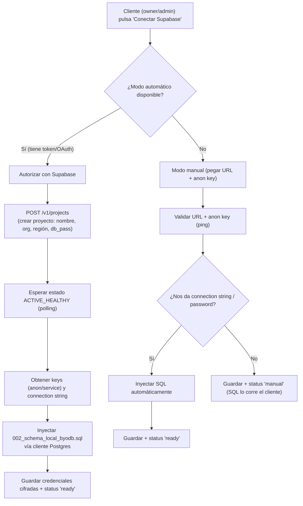

# Diseño — Integración BYODB con Supabase (aprovisionamiento automático)

> **Estado:** Fase 1 — Diseño (sin código implementado aún).
> **Fecha:** 2026-08-18
> **Propietario:** Backend / Conectividad (jurisdicción del usuario, no de Don Emilio).
> **Alcance:** Definir el flujo "híbrido" para conectar la base de datos propia (BYODB) de cada
> organización, incluyendo creación automática del proyecto Supabase e inyección del schema SQL.

---

## 1. Visión y objetivo (en cristiano)

Hoy el botón "Conectar Supabase" (`connectByodb`) solo **guarda credenciales que el cliente pega a mano**,
y el cliente además tiene que **crear su proyecto Supabase y ejecutar el SQL por su cuenta**.

La visión es que este botón sea una **integración "mágica"**:

> El cliente pulsa "Conectar Supabase" → NUH **crea el proyecto por él** → NUH **inyecta el SQL
> automáticamente** → el cliente queda conectado **sin saber nada técnico**.

Como ese camino tiene limitaciones (cuotas de la API de Supabase, cuentas de pago, etc.), el diseño es
**híbrido**: primero intenta el camino automático, y si no se puede, cae al modo manual actual.

---

## 2. Lo que existe hoy (`VERIFICADO`)

| Pieza | Estado | Archivo |
|---|---|---|
| `connectByodb` (validar URL + anon key, ping a `scheduled_posts`, cifrar y guardar) | ✅ existe | `app/actions/byodb.ts` |
| `getByodbStatus` (devuelve si está conectado + dominio) | ✅ existe | `app/actions/byodb.ts` |
| Cifrado AES-256-GCM | ✅ existe | `lib/crypto.ts` |
| Cliente para BYODB (inyecta `x-org-id`) | ✅ existe | `lib/supabase.ts` (`createLocalClient`) |
| Schema SQL del tenant | ✅ existe (manual) | `supabase/migrations/002_schema_local_byodb.sql` |
| Columnas en `organizations` | 🟡 solo `byodb_url_enc`, `byodb_key_enc` | `001_schema_central.sql` |
| Cliente de la **Management API** de Supabase (`api.supabase.com`) | ❌ no existe | — |
| Runner de SQL (conectar a Postgres y ejecutar DDL) | ❌ no existe | — |
| OAuth/PAT de Supabase | ❌ no existe | — |

---

## 3. Flujo híbrido (diagrama)

> **Qué representa:** los dos caminos del modelo híbrido y dónde se inyecta el SQL.
> **Limitación:** no dibuja los reintentos, la cancelación ni el manejo de errores por paso (ver §8).

---

## 4. Decisión de autorización (recomendación por fases)

| Fase | Mecanismo | Por qué |
|---|---|---|
| 1 (MVP) | **Modo manual** (URL + anon key) + inyección de SQL si dan connection string | Valor inmediato, sin dependencias externas |
| 2 | **PAT** (Personal Access Token) para auto-crear proyectos | Rápido de validar la Management API |
| 3 | **OAuth de Supabase** | Experiencia final sin fricción, token refrescable |

**Recomendación de seguridad:** NUNCA guardar el PAT/OAuth sin cifrar. Cifrar en reposo con
`BYODB_ENCRYPTION_KEY` (igual que ya se hace con URL y anon key). Preferir OAuth en producción porque
un PAT comprometido da acceso a toda la cuenta del cliente.

---

## 5. Cambios en el modelo de datos (nueva migración `003`)

Nuevas columnas en `public.organizations`:

| Columna | Tipo | Propósito |
|---|---|---|
| `byodb_provisioning_status` | TEXT (enum `none/provisioning/ready/manual/failed`) | Máquina de estados del aprovisionamiento |
| `byodb_project_ref` | TEXT | Ref del proyecto Supabase (ej. `abcdefghijklmno`) |
| `byodb_db_password_enc` | TEXT | Contraseña de la BD (cifrada) — necesaria para inyectar SQL |
| `byodb_connection_string_enc` | TEXT | Connection string (cifrada), opcional |
| `byodb_pat_enc` | TEXT | PAT de Supabase (cifrado), solo fase 2 |
| `byodb_error` | TEXT | Último error de aprovisionamiento (para la UI) |

> **Nota de seguridad:** la contraseña de la BD y el PAT son secretos de alto valor. Cifrar siempre
> con AES-256-GCM (`lib/crypto.ts`) y exponer solo campos seguros a la UI (nunca el valor descifrado).

---

## 6. Componentes de código nuevos (a implementar en fases 2-3)

| Módulo | Responsabilidad |
|---|---|
| `lib/supabase-management.ts` | Cliente de `api.supabase.com`: `createProject()`, `getProject()`, `getProjectKeys()`, `getDatabase()` |
| `lib/sql-runner.ts` | Ejecutar el contenido de `002_schema_local_byodb.sql` contra la BD del tenant vía `pg` (node-postgres), con `sslmode=require` |
| `app/actions/byodb.ts` (extender) | Nueva acción `provisionByodb()` que orquesta el flujo; `connectByodb` queda como modo manual |
| `lib/crypto.ts` (reutilizar) | `encryptText` / `decryptText` para los nuevos secretos |

**Nueva dependencia:** `pg` (node-postgres) para inyectar el SQL. (Validar con el protocolo que las
dependencias nuevas se consensuan antes de instalarlas.)

---

## 7. Contratos (resumen de llamadas externas)

| Llamada | Método | Propósito |
|---|---|---|
| `https://api.supabase.com/v1/projects` | POST | Crear proyecto |
| `https://api.supabase.com/v1/projects/{ref}` | GET | Estado del proyecto (polling) |
| `https://api.supabase.com/v1/projects/{ref}/api-keys` | GET | Obtener anon/service keys |
| `https://api.supabase.com/v1/projects/{ref}/database` | GET | Datos de conexión |
| Conexión Postgres directa | — | Inyectar el schema SQL |

---

## 8. Riesgos y preguntas abiertas (pendientes de validar con Supabase)

1. **Creación de proyectos gratuitos por API:** Supabase históricamente restringe la creación
   programática de proyectos del plan *free*. `PENDIENTE DE VALIDACIÓN`.
2. **Región:** ✅ DECIDIDO — se configura con la del cliente (se le permite elegir al conectar).
3. **Propiedad y coste:** ✅ DECIDIDO — cada proyecto vive en la **cuenta Supabase del propio cliente**
   (vía su autorización). Los datos quedan con el cliente. Sin coste para el MVP (plan gratuito de
   Supabase); solo pagaría el cliente si supera los límites gratuitos.
4. **Nombre del proyecto:** derivarlo del slug de la organización (ej. `nuh-<slug>`).
5. **Idempotencia:** si el aprovisionamiento falla a mitad, poder reintentar sin crear proyectos duplicados.
6. **Inyección de SQL:** el schema `002` usa `CREATE EXTENSION` y RLS; requiere conexión como usuario
   con privilegios (postgres), no anon.

---

## 9. Plan por fases

| Fase | Entregable | Estado |
|---|---|---|
| 1 | Este documento de diseño | ✅ hecho |
| 2 | Modo manual mejorado + inyección de SQL con connection string | ⏳ pendiente |
| 3 | Migración `003` (nuevas columnas + estados) | ⏳ pendiente |
| 4 | Cliente Management API + auto-creación con PAT | ⏳ pendiente |
| 5 | Migrar a OAuth de Supabase | ⏳ pendiente |

---

*Fin del diseño. No se implementó código en esta fase; se documentaron solo decisiones y requisitos.*
